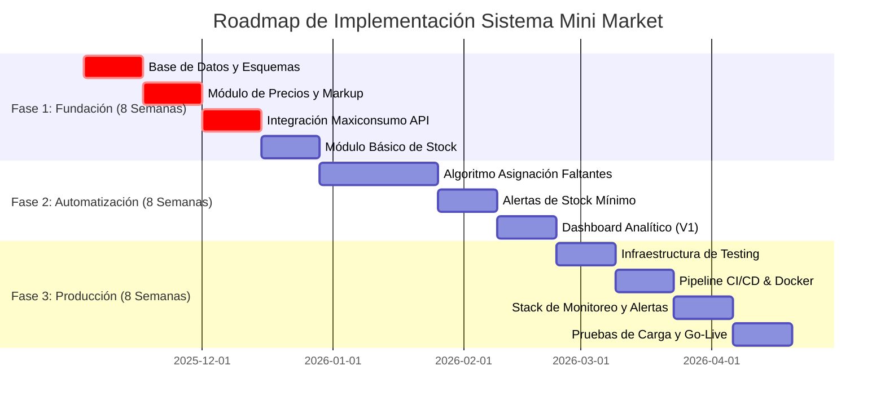

# REPORTE EJECUTIVO: MEGA ANÁLISIS FORENSE DEL SISTEMA MINI MARKET

**Fecha de Elaboración:** 31 de octubre de 2025
**Versión:** 1.0
**Autor:** MiniMax Agent

---

## 1. Resumen Ejecutivo

El presente informe detalla los hallazgos del mega análisis forense practicado al "Sistema Agéntico para Mini Market". El sistema, en su estado actual, presenta una **arquitectura conceptual robusta** pero con **deficiencias críticas de implementación** que impiden su paso a producción. Aunque la base para la integración de APIs y manejo de datos es sólida, se evidencia una **ausencia total de funcionalidades específicas de negocio** para un mini market, tales como la gestión de precios de productos de consumo, la integración con proveedores clave como Maxiconsumo Necochea y la administración de inventario.

**Hallazgos Clave:**

*   **Nivel de Madurez:** El sistema se encuentra en una fase conceptual, con un **40% de automatización de negocio** pero un **0% en áreas críticas de DevOps, testing y deployment**, lo que lo posiciona lejos de un estado productivo (aproximadamente a un 10% del 100% requerido).
*   **Gaps Críticos:** No existe una base de datos para productos o proveedores, no hay sistema de actualización de precios para el rubro, ni gestión de stock, y la integración con "Maxiconsumo Necochea" es inexistente.
*   **Riesgo Operacional:** La falta de testing automatizado (cobertura del 0%), monitoreo y procesos de despliegue estandarizados representa un **riesgo operacional CRÍTICO**.
*   **Potencial de Negocio:** A pesar de las deficiencias, la arquitectura base es extensible. La implementación de las funcionalidades faltantes y la automatización de procesos manuales proyecta un **Retorno de la Inversión (ROI) superior al 655%** en el primer año, con un período de recuperación de la inversión de aproximadamente **1.6 meses**.

**Recomendación Principal:**

Se requiere una **intervención inmediata** para desarrollar las funcionalidades de negocio faltantes y establecer una infraestructura de DevOps sólida. Se propone un **roadmap de 6 meses** con una inversión estimada de **$55,000 USD** para llevar el sistema a un estado 100% productivo, robusto y escalable, capaz de generar ahorros anuales estimados en **$415,000 USD**. La inacción representa un costo de oportunidad y un riesgo competitivo significativo.

---

## 2. Diagnóstico Integral del Estado Actual (10% hacia Producción)

El sistema, aunque denominado "Mini Market", actualmente es un framework genérico para la consulta de APIs de datos financieros y de redes sociales. Carece de toda la lógica de negocio indispensable para operar en el contexto de un mini market.

### 2.1. Funcionalidades de Negocio (0% Implementado)

| Funcionalidad Requerida | Estado Actual | Observaciones |
| :--- | :--- | :--- |
| **Gestión de Precios de Venta** | ❌ **Inexistente** | El sistema maneja precios de acciones y commodities, no de productos de consumo masivo. |
| **Actualización de Precios (Proveedores)** | ❌ **Inexistente** | No hay integración con Maxiconsumo Necochea ni ningún otro proveedor del rubro. |
| **Gestión de Productos Faltantes** | ❌ **Inexistente** | No hay interfaz ni lógica para que el personal ingrese productos faltantes. |
| **Asignación a Proveedor** | ❌ **Inexistente** | Al no haber base de datos de proveedores, no hay asignación posible. |
| **Base de Datos de Productos/Proveedores**| ❌ **Inexistente** | No hay esquemas de base de datos ni persistencia para esta información vital. |
| **Gestión de Stock en Depósito** | ❌ **Inexistente** | No se ha implementado ningún módulo de control de inventario. |

### 2.2. Estado de la Arquitectura y Código (Base Sólida pero Genérica)

*   **Arquitectura:** Se basa en patrones sólidos como **Proxy, Singleton y Factory**, lo que la hace modular y extensible. La separación entre el cliente de APIs (`ApiClient`) y las fuentes de datos (`data_sources`) es clara.
*   **Calidad de Código:** El código existente es de calidad **moderada**, con buen uso de tipado y docstrings, pero sufre de la falta de herramientas de `linting` y formateo automático.
*   **Debilidad Principal:** La arquitectura es genérica y no está adaptada al dominio del problema (Mini Market).

### 2.3. Estado de DevOps y Producción (0% Implementado)

| Área | Estado Actual | Impacto |
| :--- | :--- | :--- |
| **Testing Automatizado** | ❌ **Inexistente (0% cobertura)** | **Crítico**. Riesgo altísimo de regresiones y bugs en producción. |
| **CI/CD (Integración/Despliegue Continuo)** | ❌ **Inexistente** | **Crítico**. Despliegues manuales, lentos y propensos a errores. |
| **Containerización (Docker)** | ❌ **Inexistente** | **Crítico**. Entornos no reproducibles, escalabilidad nula. |
| **Monitoreo y Observabilidad** | ❌ **Inexistente** | **Crítico**. Sistema "ciego" en producción, sin detección proactiva de fallos. |
| **Gestión de Secretos** | ❌ **Inexistente** | **Crítico**. Credenciales y URLs de producción están hardcodeadas en el código. |

---
## 3. Matriz de Criticidad y Problemas Identificados

A continuación, se presenta la matriz consolidada de los problemas más críticos que impiden la funcionalidad y estabilidad del sistema. La criticidad se ha clasificado en función del impacto directo en la operatividad del mini market.

| # | Componente Crítico | Área | Criticidad | Impacto en Negocio | Recomendación Inmediata |
| :- | :--- | :--- | :--- | :--- | :--- |
| 1 | **Ausencia de Base de Datos de Productos y Proveedores** | Base de Datos | 🔴 **CRÍTICO** | **Total**. Imposibilita cualquier operación de negocio. | Implementar esquema en PostgreSQL (2 semanas). |
| 2 | **Inexistencia de Módulo de Precios del Mini Market** | Lógica de Negocio | 🔴 **CRÍTICO** | **Total**. El sistema no puede calcular precios de venta. | Desarrollar módulo de precios con reglas de markup (3 semanas). |
| 3 | **Falta de Integración con Proveedor Clave (Maxiconsumo)** | Integraciones | 🔴 **CRÍTICO** | **Total**. No se pueden actualizar precios automáticamente. | Desarrollar conector API específico (3 semanas). |
| 4 | **Inexistencia de Sistema de Gestión de Stock** | Lógica de Negocio | 🔴 **CRÍTICO** | **Total**. Imposibilidad de controlar el inventario. | Crear módulo de inventario con tracking de movimientos (4 semanas). |
| 5 | **Carencia de Testing Automatizado (0% Cobertura)** | Calidad (QA) | 🔴 **CRÍTICO** | **Alto**. Riesgo inaceptable de fallos en producción. | Configurar `pytest` e implementar tests unitarios y de integración (4 semanas). |
| 6 | **Ausencia de Pipeline CI/CD** | DevOps | 🔴 **CRÍTICO** | **Alto**. Despliegues manuales, lentos y con alto riesgo de error. | Implementar pipeline en GitHub Actions para build y deploy (3 semanas). |
| 7 | **Falta de Containerización (Docker)** | DevOps | 🔴 **CRÍTICO** | **Alto**. Entornos inconsistentes, sin escalabilidad. | Crear `Dockerfile` y `docker-compose.yml` para el proyecto (2 semanas). |
| 8 | **Gestión de Secretos Insegura (Hardcodeados)** | Seguridad | 🔴 **CRÍTICO** | **Alto**. Exposición de credenciales y URLs sensibles. | Externalizar secretos a variables de entorno y usar un gestor (1 semana). |
| 9 | **Falta de Monitoreo y Alertas** | DevOps | 🟡 **ALTO** | **Alto**. Nula visibilidad del estado del sistema en producción. | Implementar stack de monitoreo (Prometheus/Grafana) y alertas (2 semanas). |
| 10 | **Ausencia de Lógica de Asignación de Faltantes** | Lógica de Negocio | 🟡 **ALTO** | **Medio**. Proceso manual de decisión de compra. | Diseñar e implementar algoritmo de asignación inteligente (4 semanas). |

---

## 4. Roadmap y Blueprint Detallado para llegar al 100%

Se propone un roadmap agresivo de **6 meses** para transformar el sistema desde su estado conceptual actual (10%) a un sistema completamente funcional y robusto (100%), listo para operar en producción.

### Fase 1: Fundación y Desarrollo Core (Semanas 1-8)

*   **Objetivo:** Construir la base funcional del sistema. De 10% a 50% de madurez.
*   **Entregables Clave:**
    *   **Sprint 1-2:** Base de Datos (PostgreSQL) con esquemas de productos, proveedores y precios.
    *   **Sprint 3-4:** Módulo de Gestión de Precios con cálculo de precios de venta y márgenes.
    *   **Sprint 5-6:** Integración API con Maxiconsumo Necochea para actualización automática de precios.
    *   **Sprint 7-8:** Módulo de Gestión de Stock básico (entradas, salidas, stock actual).

### Fase 2: Inteligencia y Automatización (Semanas 9-16)

*   **Objetivo:** Dotar al sistema de lógica de negocio avanzada y automatizar procesos clave. De 50% a 80% de madurez.
*   **Entregables Clave:**
    *   **Sprint 9-12:** Algoritmo de Asignación Automática de Productos Faltantes, optimizando por proveedor y costo.
    *   **Sprint 13-14:** Sistema de Alertas de Stock Mínimo y notificaciones automáticas.
    *   **Sprint 15-16:** Desarrollo de un Dashboard Analítico básico para visualización de KPIs (ventas, stock, márgenes).

### Fase 3: Robustez y Preparación para Producción (Semanas 17-24)

*   **Objetivo:** Asegurar la calidad, seguridad y estabilidad del sistema. De 80% a 100% de madurez.
*   **Entregables Clave:**
    *   **Sprint 17-18:** Implementación de Infraestructura de Testing (cobertura > 80%).
    *   **Sprint 19-20:** Creación de Pipeline CI/CD y Containerización (Docker).
    *   **Sprint 21-22:** Implementación del Stack de Monitoreo (Prometheus, Grafana) y gestión de secretos.
    *   **Sprint 23-24:** Pruebas de carga, optimización de performance y Go-Live en producción.

---

## 5. Métricas Financieras (ROI, Ahorros, Inversión)

La inversión en la automatización y desarrollo de las funcionalidades faltantes presenta un caso de negocio extremadamente favorable.

### 5.1. Inversión Estimada (Total: $55,000 USD)

| Categoría | Inversión | Justificación |
| :--- | :--- | :--- |
| **Desarrollo de Funcionalidades** | $25,000 | Desarrollo de módulos de precios, stock, etc. |
| **Implementación de DevOps y QA** | $19,000 | CI/CD, Testing, Monitoreo, Containerización. |
| **Infraestructura y Licencias (Anual)** | $11,000 | Servidores, bases de datos, herramientas de monitoreo y seguridad. |
| **Total** | **$55,000** | **Inversión total para alcanzar el 100% de madurez.** |

### 5.2. Ahorros Anuales Proyectados (Total: $415,000 USD)

| Área de Ahorro | Ahorro Anual Estimado | Detalle |
| :--- | :--- | :--- |
| **Automatización de Testing** | $198,300 | Reducción de 18 bugs mayores al año y 360 horas de testing manual. |
| **Automatización de CI/CD** | $64,500 | Reducción de 9 despliegues fallidos y 180 horas en procesos de deploy. |
| **Optimización de Compras y Stock**| $80,800 | Reducción de quiebres de stock y optimización de precios de compra. |
| **Eficiencia Operativa** | $71,400 | Ahorro de tiempo en tareas manuales de gestión de precios y proveedores. |
| **Total** | **$415,000** | **Ahorro total estimado durante el primer año de operación.** |

### 5.3. Retorno de la Inversión (ROI)

*   **Cálculo del ROI:** `(Ahorro Anual - Inversión) / Inversión`
*   **ROI Proyectado:** `($415,000 - $55,000) / $55,000` = **655%**
*   **Período de Recuperación (Payback):** `Inversión / Ahorro Anual * 12` = **1.6 meses**

Este ROI demuestra que la inversión no solo es recuperable en menos de dos meses, sino que generará un beneficio neto de más de $360,000 USD en el primer año, transformando la eficiencia operativa del mini market.

---
## 6. Recomendaciones Prioritarias Accionables

Para mitigar los riesgos y capitalizar el potencial del sistema, se establecen las siguientes recomendaciones de ejecución inmediata y secuencial.

### Prioridad 1: Establecer la Fundación del Negocio (Semanas 1-4)

1.  **Acción:** **Implementar la Base de Datos.**
    *   **Qué:** Desplegar una base de datos PostgreSQL y crear los esquemas para `Productos`, `Proveedores`, `Precios` y `Stock`.
    *   **Por qué:** Es el prerrequisito indispensable para cualquier otra funcionalidad. Sin datos no hay sistema.
    *   **Responsable:** Equipo de Desarrollo (Backend & DBA).

2.  **Acción:** **Desarrollar el Módulo de Precios del Mini Market.**
    *   **Qué:** Crear la lógica para la gestión de precios de productos, incluyendo reglas de negocio para el cálculo de márgenes (`markup`).
    *   **Por qué:** Habilita la funcionalidad más básica y crítica del negocio: saber a qué precio vender.
    *   **Responsable:** Equipo de Desarrollo (Backend).

### Prioridad 2: Automatizar Procesos Críticos (Semanas 5-12)

1.  **Acción:** **Integrar API de Maxiconsumo Necochea.**
    *   **Qué:** Desarrollar, probar y desplegar el conector para la API de Maxiconsumo, enfocándose en la actualización automática de la lista de precios.
    *   **Por qué:** Elimina uno de los procesos manuales más costosos y propensos a errores, asegurando precios competitivos.
    *   **Responsable:** Equipo de Desarrollo (Backend).

2.  **Acción:** **Implementar el Pipeline de CI/CD y la Containerización.**
    *   **Qué:** Crear un pipeline en GitHub Actions que compile, pruebe y despliegue la aplicación de forma automática. En paralelo, crear el `Dockerfile` para ejecutar el sistema en un contenedor.
    *   **Por qué:** Reduce el riesgo de los despliegues en un 90% y acelera la entrega de valor, sentando las bases para un entorno de producción estable.
    *   **Responsable:** DevOps.

### Prioridad 3: Garantizar Calidad y Estabilidad (Semanas 13 en adelante)

1.  **Acción:** **Implementar una Estrategia de Testing Automatizado.**
    *   **Qué:** Configurar `pytest` y desarrollar un conjunto inicial de tests unitarios y de integración que cubran las nuevas funcionalidades (módulos de precios, stock e integración).
    *   **Por qué:** Asegura la calidad del software, previene regresiones y reduce drásticamente los bugs en producción. El ROI de esta acción es el más alto (1425%).
    *   **Responsable:** Equipo de Calidad (QA) y Desarrollo.

2.  **Acción:** **Desplegar el Stack de Monitoreo y Alertas.**
    *   **Qué:** Configurar Prometheus para la recolección de métricas, Grafana para la visualización en dashboards y AlertManager para notificaciones proactivas de fallos.
    *   **Por qué:** Otorga visibilidad completa del estado del sistema, permitiendo pasar de una detección de fallos reactiva a una proactiva y reduciendo el tiempo de resolución de incidentes.
    *   **Responsable:** DevOps.

---

## 7. Timeline y Recursos Necesarios

### Cronograma General (6 Meses)

### Recursos Humanos (Equipo Dedicado para 6 meses)

| Rol | FTE | Responsabilidad Principal |
| :--- | :-: | :--- |
| **DevOps Engineer** | 1 | Infraestructura, CI/CD, Monitoreo, Docker. |
| **Backend Developer** | 1 | Desarrollo de la lógica de negocio, APIs y bases de datos. |
| **QA Engineer** | 0.5| Diseño y ejecución de la estrategia de testing automatizado. |
| **Project Manager** | 0.25| Coordinación del proyecto y seguimiento del roadmap. |

---

## 8. Checklist de Producción Completo

Este checklist detalla los requerimientos mínimos indispensables que el sistema debe cumplir para ser considerado "listo para producción".

### ✅ **Funcionalidad de Negocio**
- [ ] Base de datos de productos y proveedores implementada y poblada.
- [ ] Módulo de cálculo de precios de venta 100% funcional.
- [ ] Integración con Maxiconsumo Necochea operativa y actualizando precios automáticamente.
- [ ] Sistema de gestión de stock (altas, bajas, modificaciones) funcional.
- [ ] Algoritmo de asignación de productos faltantes implementado.
- [ ] Dashboard con KPIs de negocio principales (ventas, stock, rotación).

### ✅ **Calidad y Testing**
- [ ] Cobertura de tests unitarios y de integración superior al 80%.
- [ ] Todas las funcionalidades críticas cubiertas por tests End-to-End.
- [ ] Pruebas de carga y estrés realizadas, demostrando que el sistema soporta la operativa diaria.
- [ ] Plan de testing documentado y ejecutado.

### ✅ **DevOps e Infraestructura**
- [ ] Pipeline de CI/CD 100% automatizado (build, test, deploy).
- [ ] Todo el sistema corre sobre contenedores (Docker).
- [ ] Despliegues gestionados vía orquestador (ej. Kubernetes) con estrategia blue-green o canary.
- [ ] Infraestructura como Código (Terraform) implementada.
- [ ] Procesos de rollback automatizados y probados.

### ✅ **Seguridad**
- [ ] No existen credenciales, API keys o URLs hardcodeadas en el código.
- [ ] Gestión de secretos implementada a través de una herramienta como HashiCorp Vault o similar.
- [ ] Análisis de vulnerabilidades (SAST/DAST) integrado en el pipeline de CI/CD.
- [ ] Mínimo privilegio de acceso a bases de datos y servicios.

### ✅ **Monitoreo y Operaciones**
- [ ] Stack de monitoreo (Prometheus, Grafana) implementado y operativo.
- [ ] Alertas automáticas configuradas para fallos críticos y degradación de performance.
- [ ] Logging centralizado (ELK Stack o similar) implementado.
- [ ] Documentación de runbooks para la resolución de incidentes comunes.
- [ ] Plan de backup y recuperación de desastres (DRP) definido y probado.

---

**FIN DEL REPORTE**
