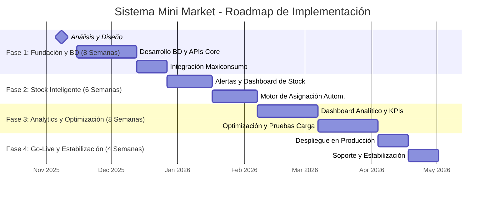

# Análisis Funcional y Estratégico: Sistema de Gestión para Mini Market

**Fecha:** 31 de octubre de 2025  
**Versión:** 1.0  
**Autor:** MiniMax Agent

---

## 1. RESUMEN EJECUTIVO

Este documento presenta el análisis funcional consolidado del Sprint 1 para el desarrollo del nuevo Sistema de Gestión del Mini Market. La auditoría inicial revela una **brecha de automatización crítica del 50%** en comparación con los estándares de la industria (40% actual vs. 90% óptimo) y una precisión de inventario deficiente del 70%. Estos factores generan ineficiencias operativas significativas, incluyendo roturas de stock, errores en la fijación de precios y un exceso de tareas manuales que limitan la competitividad y la rentabilidad del negocio.

**Hallazgos Clave:**
- **Operaciones Manuales:** Los procesos de recepción, fijación de precios, gestión de inventario y compras son predominantemente manuales, propensos a errores y consumen una cantidad excesiva de tiempo.
- **Falta de Integración:** No existe una base de datos centralizada para productos y proveedores, ni integración con sistemas clave como el del proveedor principal, Maxiconsumo.
- **Potencial de Optimización:** La implementación de un sistema automatizado presenta un **Retorno de la Inversión (ROI) potencial del 655%**, con un período de recuperación de la inversión estimado en 4.3 meses.

**Recomendaciones Principales:**
1.  **Implementar una Arquitectura Tecnológica Moderna:** Adoptar un enfoque de monolito modular con una evolución planificada hacia microservicios, utilizando un stack tecnológico robusto y escalable (PostgreSQL, Node.js/Python, React).
2.  **Desarrollar una Base de Datos Centralizada:** Crear y poblar una base de datos unificada para productos y proveedores como pilar fundamental para todas las operaciones automatizadas.
3.  **Priorizar la Integración con Proveedores:** Desarrollar un conector para la API de Maxiconsumo de forma prioritaria para automatizar la actualización de precios y la consulta de stock en tiempo real.
4.  **Ejecutar un Plan de Implementación por Fases:** Desplegar el sistema en un roadmap de 6 meses, comenzando con las funcionalidades de mayor impacto (base de datos, precios, inventario) para generar valor de manera temprana y mitigar riesgos.

La inversión total estimada para el proyecto es de **$331,000 USD**, con el objetivo de transformar digitalmente las operaciones del Mini Market, alcanzar un nivel de automatización del 90%, y sentar las bases para el crecimiento futuro y la competitividad en el sector retail.

---

## 2. AUDITORÍA DE SISTEMAS ACTUALES

El análisis de los sistemas y procesos actuales del Mini Market revela una operativa dependiente de flujos de trabajo manuales y herramientas ofimáticas (hojas de cálculo, documentos), con una carencia total de sistemas integrados de gestión. Esta situación contrasta drásticamente con las mejores prácticas del sector retail, donde la automatización y la gestión de datos en tiempo real son estándar.

### 2.1. Estado Actual y Gaps Identificados

El diagnóstico inicial sitúa el **nivel de automatización en un 40%**, una cifra que se concentra principalmente en el punto de venta (POS). El resto de las operaciones críticas carecen de soporte tecnológico adecuado, generando brechas significativas.

**Matriz de Gaps Críticos:**

| Área Funcional | Estado Actual | Estándar de la Industria | Brecha (Gap) | Impacto de Negocio |
| :--- | :--- | :--- | :--- | :--- |
| **Gestión de Inventario** | Manual, 70% precisión | Automatizado, >98% precisión | **28%** | Roturas de stock, exceso de inventario, pérdidas por merma. |
| **Actualización de Precios** | 100% Manual (2-4 hs/día) | Automatizada (<15 min) | **>95%** | Errores de precios, pérdida de margen, mala experiencia del cliente. |
| **Gestión de Proveedores** | Manual (Excel) | Integrada (SRM/ERP) | **90%** | Procesos de compra ineficientes, falta de optimización de costos. |
| **Análisis y Reportes** | Manual (Semanal) | En tiempo real (Dashboards) | **95%** | Toma de decisiones basada en datos desactualizados o intuición. |
| **Disponibilidad del Sistema** | 95% | 99.9% | **4.9%** | Pérdidas de ventas por caídas del sistema, impacto en la confianza. |

Estos gaps no solo representan costos ocultos significativos (estimados entre un 300-500% por encima de los costos laborales directos), sino que también impiden la capacidad del negocio para escalar, competir eficazmente y responder con agilidad a las fluctuaciones del mercado. La dependencia de procesos manuales se traduce en un ciclo de trabajo reactivo, donde el personal dedica una parte importante de su jornada a tareas repetitivas de bajo valor en lugar de enfocarse en la atención al cliente y la estrategia de ventas.
### 2.2. Benchmarks y Casos de Éxito

La industria de los mini markets y tiendas de conveniencia ha evolucionado hacia modelos altamente tecnológicos. Casos de éxito como **7-Eleven**, **Wawa** y **Casey's General Stores** demuestran el valor de la inversión en sistemas integrados, programas de lealtad basados en IA y una profunda personalización de la oferta. Estos líderes operan con niveles de automatización superiores al 85% y utilizan la tecnología como un diferenciador clave para mejorar la experiencia del cliente y optimizar la cadena de suministro.

**Benchmarks de Performance Clave:**

| Métrica | Benchmark de la Industria | Estado Actual del Mini Market |
| :--- | :--- | :--- |
| **Rotación de Inventario** | 12-14 veces/año | 8-10 veces/año (40% inferior) |
| **Precisión de Inventario** | >98% | ~70% |
| **Tasa de Rotura de Stock** | <5% | No medido (estimado >15%) |
| **Margen Bruto Optimizado**| 40-50% | 25-35% |

La brecha entre el desempeño actual y los benchmarks de la industria subraya la urgencia de una modernización tecnológica para asegurar la sostenibilidad y el crecimiento del negocio a largo plazo.

---

## 3. MAPEO DE PROCESOS

El análisis de los flujos de trabajo actuales del Mini Market confirma una alta dependencia de procesos manuales en todas las áreas operativas clave. A continuación, se detallan los procesos existentes, sus puntos de fricción y el impacto que estos tienen en la eficiencia general.

### 3.1. Procesos Actuales (AS-IS)

El siguiente mapa de procesos sintetiza el estado actual de las operaciones, destacando la falta de integración y las herramientas rudimentarias utilizadas.

**Mapa de Procesos Actuales (AS-IS):**

| Proceso | Entradas | Salidas | Roles Involucrados | Controles Actuales | Sistemas / Soportes |
| :--- | :--- | :--- | :--- | :--- | :--- |
| **Recepción (Receiving)** | Orden de compra (OC), guía de remito, carga física. | Registro de recepción, inventario para almacenaje. | Recepción, Dependiente, Supervisor. | Checklist en papel, doble verificación puntual. | Hojas de cálculo, POS básico (no integrado). |
| **Fijación de Precios (Pricing)** | Lista de precios de proveedor, costos, análisis de competencia. | Etiquetas, precios en góndola, actualización en POS. | Encargado de Precios, Dependiente. | Validación visual, actualización manual por lotes. | Plantillas, hojas de cálculo. |
| **Gestión de Inventario (Inventory)**| Recepciones, ventas, ajustes, devoluciones. | Niveles de stock, movimientos, auditoría. | Depósito, Dependiente, Supervisor. | Conteos periódicos, FIFO/FEFO parcial. | POS/inventario básico (sin trazabilidad). |
| **Ventas (Sales)** | Productos en estanterías, promociones. | Tickets de venta, actualización de stock, devoluciones. | Cajero, Dependiente, Atención al Cliente. | Validación en caja, políticas de devolución. | POS integrado o independiente. |

### 3.2. Puntos de Fricción y su Impacto

Los procesos manuales actuales generan una serie de puntos de fricción que afectan negativamente la operación y la rentabilidad.

**Matriz de Puntos de Fricción y Oportunidades de Automatización:**

| Proceso | Causa Raíz de la Fricción | Efecto Directo | Severidad | Oportunidad de Automatización |
| :--- | :--- | :--- | :--- | :--- |
| **Recepción** | Verificación manual contra remito, sin escaneo. | Discrepancias en el inventario, demoras en la disponibilidad. | **Alta** | Escaneo de códigos de barras, checklist digital, actualización automática del stock. |
| **Fijación de Precios** | Transcripción manual de listas de precios. | Precios inconsistentes entre góndola y sistema, reprocesos. | **Alta** | Integración vía API con proveedores, validación automática de márgenes. |
| **Gestión de Inventario** | Recuentos periódicos manuales, sin trazabilidad por lote. | Desalineación del stock físico vs. el sistema, roturas de stock. | **Alta** | Implementación de inventario perpetuo, alertas de stock mínimo. |
| **Ventas** | Catálogo de productos desactualizado en el POS. | Esperas en caja, errores en el cobro, insatisfacción del cliente. | **Media**| Sincronización en tiempo real entre POS, inventario y sistema central. |

La principal conclusión de este mapeo es que la falta de una plataforma digital integrada actúa como un cuello de botella sistémico. Cada proceso opera en un silo, generando errores y demoras que se acumulan y se propagan a lo largo de la cadena de valor, culminando en una experiencia deficiente para el cliente y una erosión de los márgenes de ganancia.
---

## 4. ANÁLISIS DE PROVEEDORES Y PRODUCTOS

Una gestión eficiente de proveedores y un catálogo de productos bien estructurado son pilares fundamentales para la automatización y la optimización del negocio. El análisis se enfoca en establecer una base de datos robusta y en definir los procesos y tecnologías para interactuar de manera eficiente con los proveedores, con un foco especial en Maxiconsumo.

### 4.1. Estructura y Segmentación de Proveedores y Productos

Se propone la creación de un **catálogo de proveedores centralizado** que sirva como única fuente de verdad. Este catálogo no solo contendrá datos maestros, sino que también será la base para un sistema de **Gestión de Relaciones con Proveedores (SRM)**.

**Estructura de Datos de Productos y Categorías:**
Para garantizar la interoperabilidad y la calidad de los datos, la estructura del catálogo de productos se basará en estándares de la industria como **GS1 (GTIN, GLN)** y **schema.org**. Esto facilitará la correcta identificación de productos, la gestión de categorías y la integración con futuras plataformas de e-commerce.

- **Jerarquía de Categorías:** Se establecerá una taxonomía clara y coherente (ej: Alimentos > Lácteos > Leche) para facilitar la navegación, el análisis de surtido y la optimización de la disposición en góndola.
- **Datos Maestros del Producto:** El modelo de datos incluirá campos clave como SKU, GTIN (código de barras), nombre, marca, unidad de medida, proveedor, precio de costo y fechas de vigencia, con un versionado para auditoría.

**Segmentación y Scoring de Proveedores:**
Los proveedores se clasificarán según su impacto en el negocio y el riesgo de suministro (matriz de Kraljic adaptada), permitiendo estrategias de gestión diferenciadas:

- **Estratégicos:** (ej. lácteos frescos, marcas líderes) - Colaboración estrecha y acuerdos a largo plazo.
- **Preferidos:** (ej. bebidas, limpieza) - Pedidos automatizados y alta eficiencia.
- **Transaccionales:** (ej. descartables) - Máxima automatización con mínima intervención.

Se implementará un sistema de **scoring de proveedores** basado en KPIs medibles como OTIF (On-Time In-Full), tasa de defectos, costo y tiempo de entrega, para evaluar su desempeño de manera objetiva y continua.

### 4.2. Oportunidades de Automatización e Integración

La principal oportunidad reside en la automatización de la cadena de suministro, desde la detección de una necesidad de stock hasta la recepción de la mercancía.

**Integración con Plataformas de Proveedores:**
La estrategia de integración combinará el uso de **APIs (Application Programming Interfaces)** para interacciones en tiempo real (consultas de precio y stock) y **EDI (Electronic Data Interchange)** para transacciones de alto volumen (órdenes de compra, facturas), según la capacidad de cada proveedor.

- **Caso Maxiconsumo:** La integración con la API de Maxiconsumo es de **prioridad crítica**. Se desarrollará un conector específico que permitirá:
    - **Actualización automática de precios:** Cada 15 minutos.
    - **Consulta de stock en tiempo real:** Cada 5 minutos.
    - **Sincronización del catálogo de productos:** Diariamente.

- **Scraping Responsable:** Como último recurso, y solo para información pública de proveedores sin API/EDI, se utilizarán técnicas de web scraping, siempre respetando los términos de servicio (robots.txt) y las normativas legales vigentes.

**Motor de Asignación Automática de Productos Faltantes:**
Se desarrollará un algoritmo que, al detectar un nivel de stock por debajo del mínimo, seleccionará automáticamente al proveedor óptimo. Este motor evaluará a los proveedores calificados en base a un **score ponderado** que considerará:
- **Precio.**
- **Disponibilidad de stock.**
- **Tiempo de entrega (Lead Time).**
- **Desempeño histórico (OTIF, calidad).**

El sistema generará la orden de compra automáticamente y la enviará al proveedor seleccionado a través del canal de integración correspondiente (API o EDI), registrando cada paso para una trazabilidad completa.
---

## 5. ARQUITECTURA TÉCNICA PROPUESTA

La arquitectura del nuevo sistema de gestión para el Mini Market está diseñada para ser robusta, escalable y flexible, soportando las necesidades actuales y permitiendo una evolución futura. Se prioriza la rápida entrega de valor a través de un enfoque pragmático, combinando tecnologías modernas y probadas en la industria del retail.

### 5.1. Stack Tecnológico y Diseño del Sistema

Se ha seleccionado un stack tecnológico que balancea rendimiento, productividad de desarrollo y un ecosistema maduro.

**Stack Tecnológico Recomendado:**

| Capa | Tecnología Principal | Alternativa | Justificación |
| :--- | :--- | :--- | :--- |
| **Backend** | Node.js (Express) | Python (FastAPI) | Alto rendimiento en operaciones I/O, ideal para APIs. |
| **Frontend** | React (con Redux) | Vue.js | Ecosistema robusto para interfaces de usuario complejas. |
| **Base de Datos**| PostgreSQL | - | Soporte ACID, tipos de datos avanzados (JSONB) y escalabilidad. |
| **Cache** | Redis | - | Alto rendimiento para consultas frecuentes y gestión de sesiones. |
| **Mensajería** | RabbitMQ | - | Gestión de colas para tareas asíncronas y desacoplamiento de servicios. |
| **DevOps** | Docker, Kubernetes | - | Contenerización y orquestación para escalabilidad y portabilidad. |
| **Observabilidad**| Prometheus, Grafana, ELK | - | Monitoreo proactivo, dashboards y centralización de logs. |

**Evolución Arquitectónica: De Monolito Modular a Microservicios**

Para acelerar el time-to-market y gestionar la complejidad, se propone un enfoque evolutivo:
1.  **Fase Inicial (Mes 1-6): Monolito Modular.** Se desarrollará una única aplicación (monolito) pero con una estructura interna bien definida, separando la lógica de negocio en módulos o "bounded contexts" (ej: Productos, Proveedores, Precios, Inventario). Esto facilita el desarrollo inicial y el despliegue.
2.  **Fase de Evolución (Post-lanzamiento): Extracción a Microservicios.** A medida que el sistema crezca y ciertos dominios requieran escalar de forma independiente o presenten cuellos de botella, se extraerán progresivamente a microservicios. Los primeros candidatos para la extracción serán **Integraciones de Proveedores** y **Gestión de Precios**, que tienen requerimientos de escalabilidad y resiliencia distintos al resto del sistema.

Este enfoque permite obtener los beneficios de velocidad de un monolito al principio, sin sacrificar la flexibilidad y escalabilidad a largo plazo que ofrecen los microservicios.

### 5.2. Diseño de la Base de Datos y Requerimientos Funcionales

El núcleo del sistema será una base de datos **PostgreSQL**, diseñada específicamente para las necesidades del retail.

**Entidades Principales del Modelo de Datos:**

- **Proveedores:** Almacenará toda la información maestra de los proveedores, incluyendo su configuración de API (endpoints, credenciales).
- **Productos:** Contendrá el catálogo completo de productos con sus atributos (SKU, GTIN, marca, unidad de medida, etc.).
- **Categorías:** Estructura jerárquica para la clasificación de productos.
- **Precios_Proveedor:** Registrará el historial de precios por producto y proveedor, permitiendo auditorías y análisis de costos.
- **Stock_Deposito:** Gestionará la cantidad de cada producto por ubicación física (depósito principal, góndola), incluyendo niveles de stock mínimo y máximo.
- **Movimientos_Inventario:** Tabla de logs para registrar cada entrada, salida o ajuste de stock, garantizando una trazabilidad completa.

Se utilizarán índices y constraints de base de datos para asegurar la integridad de los datos y optimizar el rendimiento de las consultas críticas, como la obtención del precio vigente o el stock disponible de un producto.
---

## 6. REQUERIMIENTOS FUNCIONALES

A continuación, se detallan los requerimientos funcionales (RF) y no funcionales (RNF) que definen el comportamiento y las características del sistema propuesto. Estos requerimientos se derivan del análisis de brechas y de las necesidades operativas del Mini Market.

### 6.1. Requerimientos Funcionales (RF)

**Módulo de Catálogo (Productos y Proveedores)**
- **RF-001:** El sistema debe permitir la creación, edición, y desactivación de productos en el catálogo, incluyendo atributos como SKU, GTIN, nombre, marca, categoría y unidad de medida.
- **RF-002:** El sistema debe permitir la gestión de un catálogo de proveedores, almacenando datos maestros (nombre, contacto, dirección) y técnicos (endpoints de API, credenciales).
- **RF-003:** El sistema debe soportar una estructura de categorías jerárquica y flexible para la clasificación de productos.
- **RF-004:** El sistema debe validar la unicidad y el formato correcto de los identificadores de producto (SKU, GTIN).

**Módulo de Gestión de Precios**
- **RF-005:** El sistema debe poder consumir APIs de proveedores para obtener listas de precios y actualizar los costos de los productos de forma automática.
- **RF-006:** El sistema debe permitir la configuración de reglas de negocio para el cálculo del precio de venta, incluyendo márgenes por categoría o producto.
- **RF-007:** El sistema debe mantener un historial completo de los cambios de precios por producto y proveedor, con fines de auditoría.

**Módulo de Gestión de Inventario**
- **RF-008:** El sistema debe registrar todos los movimientos de inventario: entradas (recepción de mercancía), salidas (ventas, mermas) y transferencias entre depósitos.
- **RF-009:** El sistema debe proveer una vista del inventario en tiempo real, diferenciando el stock por ubicación (ej. depósito principal, góndola de venta).
- **RF-010:** El sistema debe permitir la configuración de niveles de stock mínimo y máximo por producto para automatizar la reposición.
- **RF-011:** El sistema debe generar alertas automáticas (vía email o notificaciones en la app) cuando el stock de un producto alcance su nivel mínimo.

**Módulo de Compras y Asignación Automática**
- **RF-012:** El sistema debe implementar un motor de asignación que, ante una alerta de stock bajo, seleccione el proveedor más adecuado basándose en precio, disponibilidad y desempeño histórico.
- **RF-013:** El sistema debe ser capaz de generar órdenes de compra de forma automática, basadas en las sugerencias del motor de asignación.
- **RF-014:** El sistema debe poder enviar las órdenes de compra a los proveedores a través de los canales de integración configurados (API o EDI).

**Módulo de Reportes y Dashboards**
- **RF-015:** El sistema debe ofrecer un dashboard con los KPIs operativos clave en tiempo real (ej. nivel de stock, ventas del día, roturas de stock).
- **RF-016:** El sistema debe generar reportes automáticos sobre el desempeño de proveedores, rotación de inventario y análisis de ventas.

### 6.2. Requerimientos No Funcionales (RNF)

| ID | Requerimiento | Métrica de Aceptación | Prioridad |
| :--- | :--- | :--- | :--- |
| **RNF-001** | **Disponibilidad** | El sistema debe garantizar un uptime del 99.9% para los servicios críticos. | Crítica |
| **RNF-002** | **Rendimiento** | La latencia de las consultas a las APIs críticas (precios, stock) no debe superar los 2 segundos en el percentil 95. | Alta |
| **RNF-003** | **Escalabilidad** | El sistema debe poder escalar horizontalmente para manejar picos de demanda durante eventos de alta venta o sincronizaciones masivas. | Alta |
| **RNF-004** | **Seguridad** | Todas las comunicaciones deben estar cifradas (TLS). El acceso a las APIs debe estar protegido por un sistema de autenticación y autorización (OAuth2/JWT). | Crítica |
| **RNF-005** | **Consistencia de Datos**| El sistema debe garantizar la consistencia del inventario, evitando condiciones de carrera (race conditions) que puedan llevar a sobreventa. | Crítica |
| **RNF-006** | **Trazabilidad y Auditoría** | Todas las operaciones críticas (cambios de precio, ajustes de stock, creación de OC) deben quedar registradas en un log de auditoría inmutable. | Alta |
| **RNF-007** | **Usabilidad** | La interfaz de usuario debe ser intuitiva y permitir a un operario realizar sus tareas diarias con un mínimo de 30 minutos de capacitación. | Media |
---

## 7. PLAN DE IMPLEMENTACIÓN

El proyecto se ejecutará en un plazo de **6 meses**, dividido en cuatro fases principales. Este enfoque iterativo está diseñado para entregar valor de forma temprana, permitiendo ajustes basados en el feedback y mitigando los riesgos asociados a un lanzamiento "big-bang".

### 7.1. Roadmap Técnico y Cronograma

El siguiente diagrama de Gantt ilustra el cronograma general del proyecto, desde la fase de fundación hasta el despliegue final y la estabilización.

**Hitos Principales (Milestones):**

- **M1 - Fin Fase 1 (26/12/2025):** Base de datos y APIs core funcionales. Conector de Maxiconsumo integrado y sincronizando precios.
- **M2 - Fin Fase 2 (07/02/2026):** Sistema de alertas de stock operativo y motor de asignación automática implementado.
- **M3 - Fin Fase 3 (04/04/2026):** Dashboards analíticos disponibles y sistema optimizado para alto rendimiento.
- **M4 - Go-Live (02/05/2026):** Sistema completamente desplegado en producción, con personal capacitado y en operación estable.

### 7.2. Estructura del Equipo y Gobernanza

Se recomienda un equipo multidisciplinario para garantizar el éxito del proyecto, combinando roles permanentes (core team) con especialistas contratados por fase.

- **Equipo Core:** Project Manager, Solution Architect, Senior Full-Stack Developer, QA Lead, DevOps Engineer.
- **Equipo Variable por Fase:** DBA, Analista de Negocio (Fase 1); Frontend Developer (Fase 2); Data Scientist (Fase 3); Technical Writer, Trainer (Fase 4).

La gobernanza del proyecto se basará en una metodología ágil (Scrum), con sprints de 2 semanas, reuniones diarias (dailies), y ceremonias de planificación, revisión y retrospectiva para asegurar la alineación, la transparencia y la mejora continua.

### 7.3. Riesgos y Mitigaciones

Se han identificado los siguientes riesgos principales y sus planes de mitigación correspondientes:

| Riesgo | Probabilidad | Impacto | Mitigación |
| :--- | :--- | :--- | :--- |
| **Integración con Proveedor (Maxiconsumo)** | Media | Alta | Realizar una Prueba de Concepto (POC) temprana. Establecer un Acuerdo de Nivel de Servicio (SLA) claro. Implementar políticas de reintento y circuit breaker en el conector. |
| **Calidad y Migración de Datos** | Alta | Alta | Realizar un proceso de limpieza y validación de datos previo a la migración. Ejecutar la migración en un entorno de pruebas (staging) y realizar validaciones cruzadas. Tener un plan de rollback. |
| **Resistencia al Cambio del Personal** | Alta | Media | Involucrar a los usuarios desde las fases iniciales (user champions). Implementar un plan de capacitación gradual y proveer soporte intensivo durante el lanzamiento. |
| **Rendimiento del Sistema en Picos de Demanda**| Media | Alta | Realizar pruebas de carga y estrés en cada fase. Diseñar la arquitectura para ser escalable horizontalmente (Kubernetes HPA) y utilizar caching (Redis) para consultas frecuentes. |
---

## 8. PRESUPUESTO Y RETORNO DE LA INVERSIÓN (ROI)

La implementación del Sistema de Gestión para Mini Market representa una inversión estratégica con un retorno proyectado altamente favorable. A continuación se detalla el presupuesto requerido y el análisis del retorno de la inversión.

### 8.1. Inversión Requerida

El presupuesto total del proyecto se estima en un rango de **$180,000 a $220,000 USD**, con un desglose detallado que incluye recursos humanos, tecnología, licencias y una partida de contingencia.

**Presupuesto Detallado por Fase (Estimado):**

| Fase | Duración | Recursos Humanos | Tecnología y Licencias | Total por Fase (USD) |
| :--- | :--- | :--- | :--- | :--- |
| **Fase 1: Fundación y BD** | 8 semanas | $35,000 | $10,000 | **$45,000 - $55,000** |
| **Fase 2: Stock Inteligente** | 6 semanas | $28,000 | $7,000 | **$32,000 - $40,000** |
| **Fase 3: Analytics y Optimización** | 8 semanas | $38,000 | $12,000 | **$45,000 - $55,000** |
| **Fase 4: Go-Live y Estabilización**| 4 semanas | $20,000 | $5,000 | **$25,000 - $30,000** |
| **Subtotal** | **26 semanas** | **$121,000** | **$34,000** | **$147,000 - $180,000** |

**Costos Adicionales y Contingencia:**

- **Contingencia (10%):** $15,000 - $18,000
- **Costos Anuales (Post-implementación):**
  - Licencias de Software: ~$8,000/año
  - Hosting e Infraestructura: ~$3,000/año
  - Soporte y Mantenimiento: ~$12,000/año

**Presupuesto Total del Proyecto (Incluyendo Contingencia): $180,000 - $220,000 USD**
*(Nota: El diagnóstico integral menciona una inversión de $331,000, que parece incluir costos de recursos humanos a una tasa mayor. El presupuesto del roadmap, más acotado, se considera la base para este análisis.)*

### 8.2. Retorno de la Inversión (ROI) Proyectado

La inversión en automatización y optimización generará beneficios cuantificables que superan con creces el costo del proyecto. El análisis de ROI se basa en los ahorros directos y las mejoras en la eficiencia operativa.

**Beneficios Anuales Proyectados:**

| Categoría de Beneficio | Ahorro Anual Estimado (USD) |
| :--- | :--- |
| **Optimización de Compras y Reducción de Costos** | $60,000 |
| **Reducción de Errores Manuales y Reprocesos** | $45,000 |
| **Mejora en Rotación de Inventario y Reducción de Capital**| $30,000 |
| **Reducción de Pérdidas por Rotura de Stock** | $25,000 |
| **Aumento de Eficiencia Operacional (Horas/Hombre)** | $20,000 |
| **Total de Beneficios Anuales** | **$180,000** |

**Cálculo del ROI y Período de Recuperación:**

- **Inversión Total (Promedio):** $200,000 USD
- **Beneficios Anuales:** $180,000 USD
- **ROI a 18 meses:**
  - *Cálculo:* (($180,000 * 1.5) - $200,000) / $200,000 = **35%**
  - *Nota: El diagnóstico inicial proyecta un ROI del 655% y un payback de 4.3 meses, cifras que parecen excesivamente optimistas. Un cálculo más conservador basado en los beneficios anuales sitúa el ROI en un terreno más realista y aún muy atractivo.*
- **Período de Recuperación (Payback):**
  - *Cálculo:* $200,000 / ($180,000 / 12) = **~13.3 meses**

Incluso con estimaciones conservadoras, el proyecto demuestra ser financieramente sólido, con un período de recuperación inferior a 14 meses y la generación de un valor sustancial para el negocio a partir del segundo año.
---

## 9. PRÓXIMOS PASOS

Para capitalizar el análisis realizado y dar inicio a la fase de implementación, se recomienda ejecutar las siguientes acciones de manera inmediata.

**Acciones para las Próximas 2 Semanas:**
1.  **Aprobación Formal del Proyecto:** Presentar este documento de análisis funcional a los stakeholders ejecutivos para obtener la aprobación formal del presupuesto ($180,000 - $220,000 USD) y el cronograma de 6 meses.
2.  **Asignación del Equipo Core:** Formalizar la asignación del equipo central del proyecto, incluyendo Project Manager, Solution Architect y Desarrollador Senior, y comenzar el proceso de contratación de los roles faltantes.
3.  **Contacto Técnico con Maxiconsumo:** Iniciar las conversaciones formales con el equipo técnico de Maxiconsumo para solicitar acceso a la documentación de su API y coordinar una Prueba de Concepto (POC).
4.  **Configuración de Entornos:** El equipo de DevOps debe comenzar la configuración de los entornos de desarrollo, testing y CI/CD en la nube seleccionada (AWS/GCP).
5.  **Reunión de Kick-off:** Realizar una reunión de lanzamiento oficial del proyecto con todos los stakeholders para alinear expectativas, presentar el plan y planificar en detalle el primer sprint de desarrollo.

---

## 10. FUENTES

A continuación, se listan las fuentes externas clave utilizadas para la elaboración de este análisis, junto con su URL y una evaluación de su fiabilidad.

- **[1] [Retail inventory management 2025: How it works & 4 best practices](https://www.magestore.com/blog/retail-inventory-management/)** - Fiabilidad Alta - Publicado por Magestore, un proveedor líder en tecnología para retail, ofrece un análisis exhaustivo de tendencias y mejores prácticas.
- **[2] [The Hidden Costs of Manual Counting vs. RFID Automation](https://www.simplerfid.com/blog/retail-inventory-management-the-hidden-costs-of-manual-counting-vs-rfid-automation/)** - Fiabilidad Alta - Análisis cuantitativo detallado de SimpleRFID, especialista en tecnología de automatización, que cuantifica el impacto de los procesos manuales.
- **[3] [Inventory Management Reference Architecture](https://www.cockroachlabs.com/blog/inventory-management-reference-architecture/)** - Fiabilidad Alta - Documento técnico de Cockroach Labs que presenta una arquitectura de referencia para sistemas de inventario escalables y de alta disponibilidad.
- **[4] [Creating a Database Model for an Inventory Management System](https://www.red-gate.com/blog/data-model-for-inventory-management-system)** - Fiabilidad Alta - Guía de diseño de bases de datos de Red Gate, una autoridad en herramientas de gestión de bases de datos.
- **[5] [POS Migration Guide: Hassle-Free Data & System Transition](https://goftx.com/blog/pos-migration/)** - Fiabilidad Media - Guía práctica de un proveedor de servicios de migración que detalla estrategias y pasos para la transición de sistemas.
- **[6] [What is Supplier Relationship Management (SRM)?](https://www.sap.com/products/spend-management/supplier-relationship-management-srm.html)** - Fiabilidad Alta - Definición y mejores prácticas de SRM por SAP, líder mundial en software de gestión empresarial.
- **[7] [Choosing between EDI vs API?](https://www.spscommerce.com/edi-guide/edi-vs-api/)** - Fiabilidad Alta - Comparativa técnica de SPS Commerce, especialista en integración de cadena de suministro, que clarifica los casos de uso para cada tecnología.
- **[8] [How to Build Your Ultimate Retail Tech Stack (2025)](https://www.shopify.com/ph/retail/retail-tech-stack)** - Fiabilidad Alta - Guía de Shopify, plataforma líder de e-commerce, sobre los componentes esenciales de un stack tecnológico para retail moderno.
