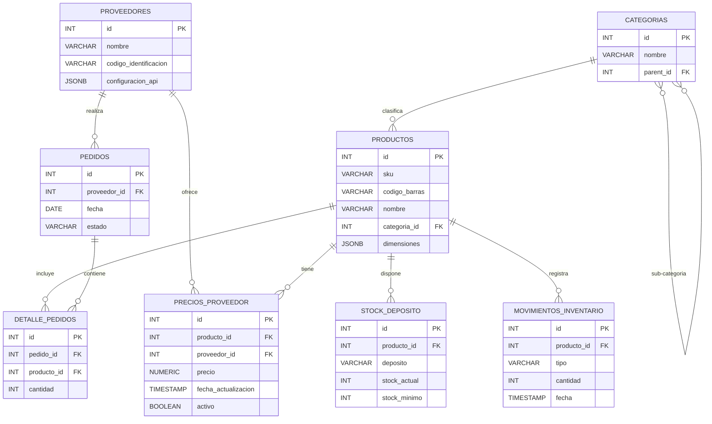
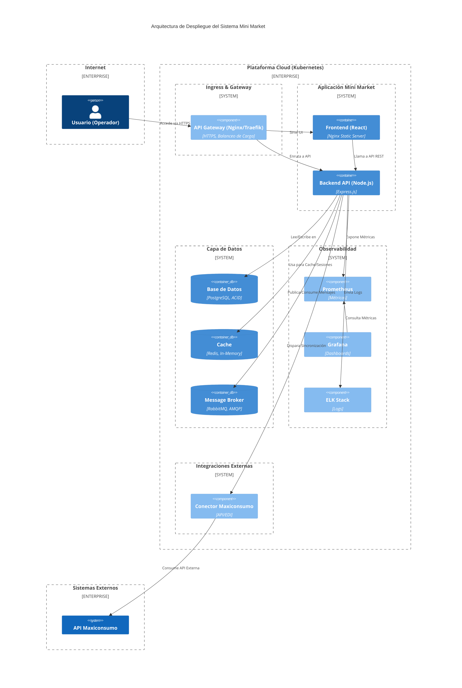
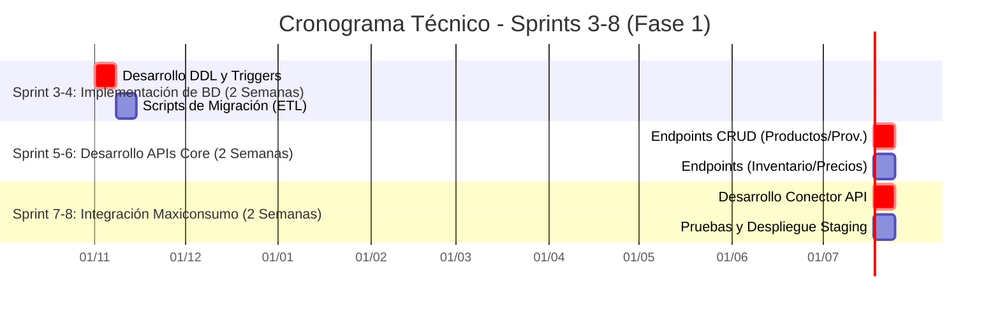

# Especificaciones Técnicas Detalladas del Sistema Mini Market

**Versión:** 2.0
**Fecha:** 2025-10-31
**Autor:** MiniMax Agent

---

## 1. RESUMEN EJECUTIVO TÉCNICO

Este documento constituye el **blueprint técnico integral** para el diseño, implementación y despliegue del nuevo Sistema de Gestión para el Mini Market, consolidando todos los análisis y especificaciones del Sprint 2. Su objetivo es servir como guía de referencia para los equipos de desarrollo, QA, DevOps y arquitectura durante los Sprints 3 a 8.

Las especificaciones aquí contenidas abordan las deficiencias críticas identificadas en el Sprint 1, donde se detectó una brecha de automatización del 50% y una precisión de inventario del 70%, resultando en ineficiencias operativas y pérdida de rentabilidad. La solución propuesta se basa en una arquitectura de **monolito modular** con una evolución planificada hacia microservicios, soportada por un stack tecnológico moderno y robusto.

**Decisiones y Componentes Técnicos Clave:**

1.  **Base de Datos (PostgreSQL):** Se ha diseñado un esquema relacional optimizado con 18 tablas normalizadas (3NF), más de 200 campos, y un uso estratégico de JSONB para metadatos flexibles. El diseño incluye índices compuestos y parciales, triggers para auditoría inmutable de precios y stock, y funciones almacenadas (PL/pgSQL) para encapsular lógica de negocio crítica, garantizando la integridad referencial y un rendimiento superior en consultas clave.

2.  **APIs Internas (RESTful):** Se especifica una arquitectura de APIs RESTful con más de 25 endpoints documentados bajo el estándar **OpenAPI 3.1**. La seguridad se gestiona mediante autenticación **JWT con roles (RBAC)**, y se establecen patrones consistentes para paginación, filtrado, manejo de errores, idempotencia (`Idempotency-Key`) y rate limiting, asegurando una base sólida y escalable para la comunicación entre servicios.

3.  **Integraciones con Proveedores (Maxiconsumo):** La integración con el proveedor estratégico Maxiconsumo se prioriza a través de una arquitectura de conector resiliente, que combina un enfoque **"API-first"** con fallback a EDI y scraping responsable. Se implementarán patrones de resiliencia como **timeouts, reintentos con backoff exponencial y jitter, y el patrón Circuit Breaker** para garantizar la estabilidad del sistema ante fallos externos.

4.  **Plan de Testing y QA:** Se adopta una estrategia de **pirámide de pruebas moderna**, con un fuerte énfasis en la automatización. El plan incluye pruebas unitarias (Jest/RTL), de integración (Postman/Newman), E2E para flujos críticos (Cypress) y de rendimiento (k6/JMeter), todo integrado en un pipeline de **CI/CD con GitHub Actions**, con un objetivo de cobertura de código superior al 80%.

5.  **Arquitectura y Stack Tecnológico:**
    *   **Backend:** Node.js (Express)
    *   **Frontend:** React
    *   **Base de Datos:** PostgreSQL
    *   **Cache:** Redis
    *   **Mensajería:** RabbitMQ
    - **DevOps:** Docker, Kubernetes, Prometheus, Grafana, ELK

Este documento proporciona todos los scripts SQL (DDL), especificaciones OpenAPI, configuraciones de pipeline, y diagramas de flujo necesarios para la implementación, asegurando que el equipo de desarrollo cuente con un blueprint preciso, implementable y alineado con las mejores prácticas de la industria del retail para 2025.

---

## 2. ESQUEMA DE BASE DE DATOS (POSTGRESQL)

El diseño de la base de datos es el pilar del sistema, concebido para garantizar la integridad, el rendimiento y la escalabilidad de las operaciones del Mini Market. Se ha optado por **PostgreSQL** debido a su robustez, soporte para tipos de datos avanzados como JSONB, y su capacidad para manejar cargas de trabajo transaccionales complejas, características que son fundamentales para un sistema de gestión de inventario y precios en tiempo real.

### 2.1. Principios de Diseño y Modelo de Datos

El esquema se adhiere a la **Tercera Forma Normal (3NF)** para minimizar la redundancia y maximizar la integridad de los datos en las entidades núcleo (Productos, Proveedores, Precios, Inventario). Sin embargo, se aplica una **desnormalización selectiva y pragmática** mediante el uso de campos `JSONB` para almacenar metadatos flexibles (ej. atributos de productos, configuración de APIs de proveedores), evitando la rigidez de un esquema puramente relacional y facilitando futuras extensiones sin necesidad de migraciones complejas.

- **Claves Primarias:** Se utilizan claves subrogadas (tipo `SERIAL` o `UUID`) como llaves primarias para simplificar las relaciones y optimizar los joins.
- **Integridad Referencial:** Se hace un uso extensivo de claves foráneas (`FOREIGN KEY`) con restricciones `ON DELETE RESTRICT` o `CASCADE` según el caso, para mantener la consistencia entre tablas.
- **Constraints de Negocio:** Se implementan `CHECK constraints` para validar reglas de negocio a nivel de base de datos (ej. `stock >= 0`, `precio >= 0`, estados válidos en enumeraciones), previniendo la inserción de datos corruptos desde la capa de aplicación.

### 2.2. Diagrama de Entidad-Relación (ERD)

A continuación, se presenta un diagrama lógico que ilustra las principales entidades y sus relaciones:



### 2.3. Scripts DDL (Data Definition Language) Completos

Se proporciona el conjunto completo de scripts SQL para la creación de todas las tablas, índices, triggers y funciones almacenadas. Estos scripts están diseñados para ser ejecutados en un entorno PostgreSQL y son la base para el despliegue inicial de la base de datos.

**Tablas Principales, Índices y Constraints:**

```sql
-- Habilitar extensiones recomendadas
CREATE EXTENSION IF NOT EXISTS "uuid-ossp";

-- Módulo de Proveedores
CREATE TABLE proveedores (
  id SERIAL PRIMARY KEY,
  nombre VARCHAR(255) NOT NULL,
  codigo_identificacion VARCHAR(50) UNIQUE,
  direccion TEXT,
  telefono VARCHAR(20),
  email VARCHAR(100),
  activo BOOLEAN DEFAULT TRUE,
  configuracion_api JSONB, -- Almacena credenciales y endpoints de APIs
  created_at TIMESTAMP WITH TIME ZONE DEFAULT CURRENT_TIMESTAMP,
  updated_at TIMESTAMP WITH TIME ZONE DEFAULT CURRENT_TIMESTAMP
);
CREATE INDEX idx_proveedores_nombre ON proveedores(nombre);

-- Módulo de Productos y Categorías
CREATE TABLE categorias (
  id SERIAL PRIMARY KEY,
  nombre VARCHAR(255) NOT NULL,
  margen_min NUMERIC(5,2) CHECK (margen_min >= 0 AND margen_min <= 100),
  margen_max NUMERIC(5,2) CHECK (margen_max >= 0 AND margen_max <= 100 AND margen_min <= margen_max),
  parent_id INTEGER REFERENCES categorias(id) ON DELETE SET NULL,
  created_at TIMESTAMP WITH TIME ZONE DEFAULT CURRENT_TIMESTAMP,
  updated_at TIMESTAMP WITH TIME ZONE DEFAULT CURRENT_TIMESTAMP
);
CREATE INDEX idx_categorias_parent_id ON categorias(parent_id);

CREATE TABLE productos (
  id SERIAL PRIMARY KEY,
  sku VARCHAR(50) UNIQUE NOT NULL,
  codigo_barras VARCHAR(50) UNIQUE,
  nombre VARCHAR(255) NOT NULL,
  descripcion TEXT,
  categoria_id INTEGER REFERENCES categorias(id) ON DELETE SET NULL,
  marca VARCHAR(100),
  unidad_medida VARCHAR(20),
  atributos JSONB, -- Para dimensiones, peso, etc.
  activo BOOLEAN DEFAULT TRUE,
  created_at TIMESTAMP WITH TIME ZONE DEFAULT CURRENT_TIMESTAMP,
  updated_at TIMESTAMP WITH TIME ZONE DEFAULT CURRENT_TIMESTAMP
);
CREATE INDEX idx_productos_categoria_id ON productos(categoria_id);
CREATE INDEX idx_productos_nombre_trgm ON productos USING GIN (nombre gin_trgm_ops); -- Para búsquedas de texto eficientes

-- Módulo de Precios
CREATE TABLE precios_proveedor (
  id SERIAL PRIMARY KEY,
  producto_id INTEGER NOT NULL REFERENCES productos(id) ON DELETE CASCADE,
  proveedor_id INTEGER NOT NULL REFERENCES proveedores(id) ON DELETE CASCADE,
  precio NUMERIC(10,2) NOT NULL CHECK (precio >= 0),
  precio_anterior NUMERIC(10,2),
  fecha_actualizacion TIMESTAMP WITH TIME ZONE DEFAULT CURRENT_TIMESTAMP,
  fuente_actualizacion VARCHAR(50), -- ej: 'API', 'MANUAL'
  activo BOOLEAN DEFAULT TRUE,
  UNIQUE (producto_id, proveedor_id, activo) --Constraint para asegurar un único precio activo por proveedor y producto
);
CREATE INDEX idx_precios_proveedor_producto_id ON precios_proveedor(producto_id);

-- Módulo de Inventario
CREATE TABLE stock_deposito (
  id SERIAL PRIMARY KEY,
  producto_id INTEGER NOT NULL REFERENCES productos(id) ON DELETE CASCADE,
  deposito VARCHAR(100) NOT NULL, -- ej: 'PRINCIPAL', 'GONDOLA_1'
  stock_actual INTEGER NOT NULL DEFAULT 0 CHECK (stock_actual >= 0),
  stock_minimo INTEGER NOT NULL DEFAULT 0 CHECK (stock_minimo >= 0),
  stock_maximo INTEGER,
  ubicacion_fisica VARCHAR(100),
  ultima_actualizacion TIMESTAMP WITH TIME ZONE DEFAULT CURRENT_TIMESTAMP,
  UNIQUE (producto_id, deposito)
);

CREATE TABLE movimientos_inventario (
  id BIGSERIAL PRIMARY KEY,
  producto_id INTEGER NOT NULL REFERENCES productos(id),
  tipo VARCHAR(20) NOT NULL CHECK (tipo IN ('entrada', 'salida', 'ajuste', 'transferencia')),
  cantidad INTEGER NOT NULL,
  origen VARCHAR(100),
  destino VARCHAR(100),
  fecha TIMESTAMP WITH TIME ZONE DEFAULT CURRENT_TIMESTAMP,
  usuario VARCHAR(100),
  referencia_id VARCHAR(100) -- ID de OC, venta, etc.
);
CREATE INDEX idx_movimientos_inventario_producto_id ON movimientos_inventario(producto_id, fecha DESC);

-- Módulo de Compras
CREATE TABLE pedidos (
  id SERIAL PRIMARY KEY,
  proveedor_id INTEGER NOT NULL REFERENCES proveedores(id),
  fecha DATE DEFAULT CURRENT_DATE,
  estado VARCHAR(20) NOT NULL CHECK (estado IN ('borrador', 'aprobado', 'enviado', 'recibido', 'cancelado')),
  total_estimado NUMERIC(12,2),
  created_at TIMESTAMP WITH TIME ZONE DEFAULT CURRENT_TIMESTAMP,
  updated_at TIMESTAMP WITH TIME ZONE DEFAULT CURRENT_TIMESTAMP
);

CREATE TABLE detalle_pedidos (
  id SERIAL PRIMARY KEY,
  pedido_id INTEGER NOT NULL REFERENCES pedidos(id) ON DELETE CASCADE,
  producto_id INTEGER NOT NULL REFERENCES productos(id),
  cantidad INTEGER NOT NULL CHECK (cantidad > 0),
  precio_unitario NUMERIC(10,2) NOT NULL CHECK (precio_unitario >= 0)
);
```

**Triggers y Funciones para Auditoría y Mantenimiento:**

Para garantizar la trazabilidad y la integridad, se implementarán triggers que registren automáticamente los cambios en tablas críticas.

```sql
-- Trigger para actualizar el campo 'updated_at' automáticamente
CREATE OR REPLACE FUNCTION update_updated_at_column()
RETURNS TRIGGER AS $$
BEGIN
   NEW.updated_at = NOW();
   RETURN NEW;
END;
$$ language 'plpgsql';

CREATE TRIGGER update_proveedores_modtime BEFORE UPDATE ON proveedores FOR EACH ROW EXECUTE PROCEDURE update_updated_at_column();
CREATE TRIGGER update_productos_modtime BEFORE UPDATE ON productos FOR EACH ROW EXECUTE PROCEDURE update_updated_at_column();
CREATE TRIGGER update_pedidos_modtime BEFORE UPDATE ON pedidos FOR EACH ROW EXECUTE PROCEDURE update_updated_at_column();

-- Tablas de Auditoría
CREATE TABLE price_history (
  id BIGSERIAL PRIMARY KEY,
  producto_id INTEGER NOT NULL,
  proveedor_id INTEGER NOT NULL,
  precio_anterior NUMERIC(10,2),
  precio_nuevo NUMERIC(10,2) NOT NULL,
  fecha_cambio TIMESTAMP WITH TIME ZONE DEFAULT CURRENT_TIMESTAMP,
  usuario_cambio VARCHAR(100)
) PARTITION BY RANGE (fecha_cambio);

CREATE TABLE stock_auditoria (
  id BIGSERIAL PRIMARY KEY,
  movimiento_id BIGINT NOT NULL,
  producto_id INTEGER NOT NULL,
  deposito VARCHAR(100) NOT NULL,
  stock_anterior INTEGER NOT NULL,
  stock_nuevo INTEGER NOT NULL,
  fecha_cambio TIMESTAMP WITH TIME ZONE DEFAULT CURRENT_TIMESTAMP
) PARTITION BY RANGE (fecha_cambio);

-- Trigger para auditoría de precios
CREATE OR REPLACE FUNCTION log_price_change()
RETURNS TRIGGER AS $$
BEGIN
  INSERT INTO price_history (producto_id, proveedor_id, precio_anterior, precio_nuevo, usuario_cambio)
  VALUES (NEW.producto_id, NEW.proveedor_id, OLD.precio, NEW.precio, current_user);
  RETURN NEW;
END;
$$ LANGUAGE plpgsql;

CREATE TRIGGER price_change_trigger
AFTER UPDATE OF precio ON precios_proveedor
FOR EACH ROW
WHEN (OLD.precio IS DISTINCT FROM NEW.precio)
EXECUTE FUNCTION log_price_change();
```

### 2.4. Estrategias de Optimización y Rendimiento

El rendimiento de la base de datos es crucial para la experiencia del usuario y la eficiencia operativa. Se han definido las siguientes estrategias de optimización:

- **Indexación Inteligente:** Además de los índices en claves primarias y foráneas, se crean índices compuestos (ej. `(producto_id, deposito)`) para acelerar consultas comunes y se utiliza la extensión `pg_trgm` para búsquedas de texto eficientes en nombres de productos.
- **Particionamiento de Tablas:** Las tablas de auditoría (`price_history`, `stock_auditoria`), que crecerán indefinidamente, se particionarán por rango de fecha (mensual o trimestral). Esto mejora drásticamente el rendimiento de las consultas sobre datos históricos y simplifica las tareas de mantenimiento como backups y archivado.
- **Vistas Materializadas:** Para los reportes y dashboards que requieren agregaciones complejas (ej. ventas por categoría, rotación de inventario), se utilizarán vistas materializadas que se refrescarán periódicamente (ej. cada hora o al final del día), evitando que las consultas analíticas sobrecarguen la base de datos transaccional.
- **Tuning de PostgreSQL:** Se realizará un ajuste fino de la configuración de PostgreSQL (`postgresql.conf`) en el entorno de producción, optimizando parámetros como `shared_buffers`, `work_mem` y `maintenance_work_mem` de acuerdo a la carga de trabajo real del sistema.

Estas decisiones de diseño y optimización aseguran que la base de datos no solo soporte los requerimientos actuales del Mini Market, sino que también esté preparada para escalar y evolucionar junto con el negocio.

---

## 3. APIS INTERNAS ESPECIFICACIÓN

La arquitectura de APIs internas es el sistema nervioso del Sistema Mini Market, proveyendo una interfaz estandarizada, segura y escalable para que los distintos componentes (frontend, aplicaciones móviles futuras, integraciones) interactúen con la lógica de negocio y los datos. Se ha diseñado siguiendo los principios **RESTful**, promoviendo la predictibilidad y la facilidad de uso para los desarrolladores.

### 3.1. Principios de Diseño y Arquitectura REST

- **Modelo de Recursos:** Las APIs se centran en recursos (ej. `products`, `suppliers`, `inventory`), expuestos a través de URIs predecibles y consistentes (sustantivos en plural).
- **Uso Semántico de Métodos HTTP:**
    - `GET`: Para recuperar recursos (operación segura e idempotente).
    - `POST`: Para crear nuevos recursos.
    - `PUT`: Para reemplazar un recurso existente en su totalidad (idempotente).
    - `PATCH`: Para aplicar actualizaciones parciales a un recurso (idempotente).
    - `DELETE`: Para eliminar un recurso (usualmente, una desactivación lógica).
- **Versionado en la URI:** Para garantizar la estabilidad y evitar breaking changes, todas las APIs serán versionadas en su ruta, comenzando con `/v1/` (ej. `/v1/products`).
- **Respuestas JSON:** Todos los datos se intercambiarán en formato JSON, con una estructura de respuesta consistente que incluye paginación, metadatos y enlaces HATEOAS cuando sea aplicable.
- **Manejo de Errores Estándar:** Los errores se comunican mediante los códigos de estado HTTP apropiados (4xx para errores del cliente, 5xx para errores del servidor) y un cuerpo de respuesta JSON estructurado que detalla el error.

### 3.2. Especificación OpenAPI 3.1

El contrato de las APIs se documentará formalmente utilizando la **Especificación OpenAPI 3.1**. Esto no solo proporciona una documentación interactiva y clara (a través de herramientas como Swagger UI), sino que también permite la generación automática de clientes de API, la validación de solicitudes y respuestas, y la configuración de pruebas de contrato.

A continuación, se presenta un extracto de la plantilla OpenAPI que se utilizará, mostrando la estructura para el recurso de productos:

```yaml
openapi: 3.1.0
info:
  title: Mini Market APIs
  version: "1.0.0"
servers:
  - url: /v1
paths:
  /products:
    get:
      summary: Lista de Productos
      tags:
        - Products
      parameters:
        - name: q
          in: query
          description: Búsqueda por nombre o SKU
          schema:
            type: string
        - name: page
          in: query
          schema:
            type: integer
            default: 1
        - name: pageSize
          in: query
          schema:
            type: integer
            default: 20
      responses:
        '200':
          description: Lista paginada de productos.
          content:
            application/json:
              schema:
                $ref: '#/components/schemas/ProductPage'
  /products/{id}:
    get:
      summary: Obtener un Producto por ID
      tags:
        - Products
      parameters:
        - name: id
          in: path
          required: true
          schema:
            type: integer
      responses:
        '200':
          description: Detalles del producto.
          content:
            application/json:
              schema:
                $ref: '#/components/schemas/Product'
        '404':
          $ref: '#/components/responses/NotFound'

components:
  schemas:
    Product:
      type: object
      properties:
        id: { type: integer }
        sku: { type: string }
        nombre: { type: string }
        # ... otros campos
    ProductPage:
      type: object
      properties:
        data:
          type: array
          items:
            $ref: '#/components/schemas/Product'
        meta:
          type: object
          properties:
            page: { type: integer }
            pageSize: { type: integer }
            total: { type: integer }
  responses:
    NotFound:
      description: El recurso solicitado no fue encontrado.
      content:
        application/json:
          schema:
            type: object
            properties:
              error: { type: string, example: 'not_found' }

security:
  - bearerAuth: []

components:
  securitySchemes:
    bearerAuth:
      type: http
      scheme: bearer
      bearerFormat: JWT
```

### 3.3. Seguridad: Autenticación y Autorización (JWT + RBAC)

La seguridad es un pilar no negociable. Se implementará un flujo de autenticación robusto basado en **JSON Web Tokens (JWT)** con el estándar OAuth2.

- **Autenticación:** El cliente (frontend) se autenticará contra un endpoint `/auth/login` con credenciales de usuario. Si son válidas, el servidor emitirá un `access_token` (JWT) de corta duración y un `refresh_token` de larga duración. El `access_token` se enviará en el encabezado `Authorization: Bearer <token>` en todas las solicitudes a endpoints protegidos.
- **Autorización (RBAC):** El payload del JWT contendrá el rol del usuario (ej. `admin`, `operador`, `viewer`). En el backend, un middleware de autorización validará que el rol del usuario tenga los permisos necesarios para acceder al recurso y al método solicitado. Por ejemplo, un `viewer` podrá hacer `GET` a `/products` pero no `POST`.
- **Seguridad del Token:** Los JWTs serán firmados con un secreto robusto (algoritmo HS256 o RS256). Los `refresh_tokens` se almacenarán de forma segura y se utilizarán para obtener nuevos `access_tokens` sin necesidad de que el usuario vuelva a iniciar sesión.

### 3.4. Catálogo de Endpoints Principales

A continuación se detallan los endpoints más importantes por módulo, siguiendo la especificación RESTful.

**Módulo de Productos**
*   `GET /v1/products`: Lista productos con filtros (búsqueda, categoría) y paginación.
*   `POST /v1/products`: Crea un nuevo producto.
*   `GET /v1/products/{id}`: Obtiene los detalles de un producto específico.
*   `PATCH /v1/products/{id}`: Actualiza parcialmente un producto.
*   `DELETE /v1/products/{id}`: Desactiva un producto (borrado lógico).

**Módulo de Proveedores**
*   `GET /v1/suppliers`: Lista todos los proveedores.
*   `POST /v1/suppliers`: Crea un nuevo proveedor.
*   `GET /v1/suppliers/{id}`: Obtiene los detalles de un proveedor.
*   `PATCH /v1/suppliers/{id}`: Actualiza la información de un proveedor.

**Módulo de Inventario**
*   `GET /v1/inventory/stock`: Consulta el stock actual por producto y/o depósito.
*   `POST /v1/inventory/movements`: Registra un nuevo movimiento de inventario (entrada, salida, ajuste). Esta operación será **idempotente** mediante el uso del encabezado `Idempotency-Key` para evitar registros duplicados en caso de reintentos de red.
*   `GET /v1/inventory/movements`: Obtiene un historial de movimientos para auditoría.

**Módulo de Precios**
*   `GET /v1/prices/current`: Obtiene el precio activo de uno o varios productos, opcionalmente filtrando por proveedor.
*   `GET /v1/prices/history`: Devuelve el historial de cambios de precio para un producto.
*   `POST /v1/prices/bulk-apply`: Permite la actualización masiva de precios, una operación idempotente para la sincronización con proveedores.

### 3.5. Patrones Transversales

- **Paginación:** Las respuestas de listas (`GET /v1/products`) incluirán metadatos de paginación (`page`, `pageSize`, `totalItems`, `totalPages`) y enlaces HATEOAS (`first`, `last`, `next`, `prev`) para facilitar la navegación.
- **Rate Limiting:** Se implementará un limitador de velocidad por IP y/o por usuario para prevenir abusos y asegurar la estabilidad del sistema. Las respuestas que excedan el límite devolverán un código `429 Too Many Requests` con un encabezado `Retry-After`.
- **CORS (Cross-Origin Resource Sharing):** Se configurará una política de CORS estricta para permitir solicitudes únicamente desde los dominios autorizados del frontend, mejorando la seguridad del sistema.

---

## 4. INTEGRACIONES CON PROVEEDORES

La automatización de la cadena de suministro es un pilar fundamental para la competitividad del Mini Market. La arquitectura de integraciones está diseñada para ser resiliente, escalable y adaptable a las diversas capacidades tecnológicas de los proveedores, con un enfoque prioritario en la integración con **Maxiconsumo**.

### 4.1. Arquitectura del Conector y Estrategia de Integración

Se adopta un enfoque híbrido, seleccionando el mejor método de integración según el proveedor y el caso de uso:

1.  **API-First (Preferido):** Para proveedores con capacidades de API (como se espera de Maxiconsumo), se desarrollarán conectores RESTful. Este método es ideal para obtener datos en tiempo real o casi real, como precios y stock.
2.  **EDI (Electronic Data Interchange):** Para transacciones de alto volumen y estandarizadas (órdenes de compra, facturas), se utilizará EDI si el proveedor lo soporta. Se considerarán los documentos estándar del retail como `EDI 850` (Orden de Compra) y `EDI 846` (Consulta de Inventario).
3.  **Scraping Responsable (Último Recurso):** Para proveedores sin API ni EDI, se implementará web scraping para obtener información pública (precios, catálogo). Esta técnica se usará con máxima precaución, respetando `robots.txt`, aplicando `rate limiting` agresivo y con validación legal previa para asegurar el cumplimiento de los términos de servicio.

El **conector de Maxiconsumo** será el primero en ser desarrollado y servirá como blueprint para futuras integraciones. Su arquitectura interna constará de las siguientes capas:
- **Capa de Cliente HTTP:** Gestionará las conexiones, los timeouts y el manejo de códigos de estado.
- **Capa de Autenticación:** Manejará la obtención y rotación de `API Keys` o tokens `OAuth2`.
- **Capa de Resiliencia:** Implementará los patrones de reintentos, backoff y circuit breaker.
- **Capa de Datos:** Validará los payloads (JSON Schema), normalizará los datos al modelo interno del Mini Market y los pasará a la capa de negocio para su procesamiento.

### 4.2. Patrones de Resiliencia

Las integraciones con sistemas externos son inherentemente frágiles. Para garantizar la estabilidad del sistema, se implementarán los siguientes patrones de resiliencia:

- **Timeouts Agresivos:** Cada solicitud a un proveedor tendrá un timeout corto (ej. 2-5 segundos) para evitar que una API lenta degrade el rendimiento de todo el sistema.
- **Reintentos con Backoff Exponencial y Jitter:**
    - Para errores transitorios (ej. `503 Service Unavailable`, timeouts de red), el conector reintentará la solicitud automáticamente.
    - El tiempo de espera entre reintentos aumentará exponencialmente (ej. 1s, 2s, 4s, ...) para no sobrecargar al proveedor.
    - Se añadirá un `jitter` (un pequeño retardo aleatorio) para evitar que múltiples instancias del sistema reintenten al mismo tiempo (efecto "thundering herd").
    - Solo se reintentarán operaciones **idempotentes** (`GET`, `PUT`, `DELETE`) o `POST` que estén protegidas con `Idempotency-Key`.
- **Patrón Circuit Breaker:**
    - Cada conector tendrá un "interruptor" que monitorea la tasa de fallos.
    - Si la tasa de errores hacia un proveedor supera un umbral (ej. 50% de fallos en 1 minuto), el circuit breaker se "abrirá", y el sistema dejará de enviar solicitudes a ese proveedor por un período de tiempo determinado (ej. 5 minutos).
    - Durante este tiempo, el sistema puede operar con datos cacheados o activar un flujo de fallback.
    - Después del período de espera, el circuit breaker pasará a un estado de "semi-abierto", permitiendo que una solicitud de prueba pase. Si tiene éxito, el circuito se "cierra" y la operación normal se reanuda. Si falla, vuelve a abrirse.

```mermaid
stateDiagram-v2
    [*] --> Closed
    Closed --> Open: Falla > Umbral
    Open --> HalfOpen: Después de Timeout
    HalfOpen --> Closed: Éxito
    HalfOpen --> Open: Falla

    state Closed {
        description: Operación Normal
    }
    state Open {
        description: Peticiones bloqueadas
    }
    state HalfOpen {
        description: Petición de prueba
    }
```

### 4.3. Sincronización de Datos y Caching

La frescura de los datos del proveedor es crítica, pero las llamadas constantes a las APIs son ineficientes y costosas. Se implementará una estrategia de sincronización y caching utilizando **Redis**.

- **Proceso de Sincronización (Polling):** Un `scheduler` (ej. un cron job en Kubernetes o una librería como `node-cron`) ejecutará tareas periódicas para sincronizar los datos de los proveedores:
    - **Precios (Maxiconsumo):** Cada 15 minutos.
    - **Stock (Maxiconsumo):** Cada 5 minutos.
    - **Catálogo de Productos:** Diariamente (durante la noche).
- **Caching (Redis):**
    - Los datos obtenidos de los proveedores se almacenarán en Redis con un **TTL (Time-To-Live)** ligeramente superior al intervalo de polling (ej. un TTL de 16 minutos para precios).
    - Las APIs internas del Mini Market (ej. `GET /v1/prices/current`) consultarán primero Redis. Si los datos están en caché (cache hit), se devuelven instantáneamente. Si no (cache miss), se consultan de la base de datos PostgreSQL y se almacenan en Redis para futuras solicitudes.
    - Este patrón, conocido como **Cache-Aside**, reduce drásticamente la carga sobre la base de datos y mejora la latencia de las APIs.

### 4.4. Observabilidad y Monitoreo de Integraciones

Es fundamental tener visibilidad sobre la salud de las integraciones. Se implementará un sistema de observabilidad robusto:

- **Métricas (Prometheus):**
    - `integration_requests_total`: Contador de solicitudes por proveedor y endpoint.
    - `integration_requests_failed_total`: Contador de solicitudes fallidas.
    - `integration_request_duration_seconds`: Histograma de la latencia de las solicitudes.
    - `circuit_breaker_state`: Estado actual del circuit breaker (0=cerrado, 1=abierto, 2=semi-abierto).
- **Logs Estructurados (ELK Stack):** Todas las solicitudes, respuestas y errores de integración se registrarán en formato JSON, incluyendo un `traceId` para correlacionar eventos a través de todo el sistema.
- **Alertas (Alertmanager):** Se configurarán alertas proactivas para notificar al equipo de operaciones sobre condiciones anómalas:
    - Si la tasa de error de una integración supera el 10% durante 5 minutos.
    - Si un circuit breaker permanece abierto por más de 10 minutos.
    - Si la "frescura" de los datos de precios o stock excede el umbral aceptable (ej. si los precios no se han actualizado en 30 minutos).

---

## 5. PLAN DE TESTING Y QA

La estrategia de calidad y pruebas es un pilar esencial para garantizar la robustez, fiabilidad y rendimiento del Sistema Mini Market. Se adopta un enfoque de **"shift-left testing"**, integrando las actividades de QA lo más temprano posible en el ciclo de vida de desarrollo. El objetivo es automatizar la mayor parte del proceso de pruebas para proporcionar un feedback rápido y continuo a los desarrolladores, permitiendo despliegues frecuentes y seguros.

### 5.1. Estrategia de la Pirámide de Pruebas Moderna

Se implementará una **pirámide de pruebas moderna** que distribuye el esfuerzo de testing de manera eficiente, maximizando el ROI y minimizando el tiempo de ejecución del pipeline.

- **Base (Pruebas Unitarias - ~70%):** Son la base de la pirámide. Rápidas y baratas de ejecutar, validan pequeñas unidades de código (funciones, componentes) de forma aislada. Se utilizará **Jest** para el backend (Node.js) y **React Testing Library (RTL)** para los componentes de frontend.
  
- **Medio (Pruebas de Integración y Contrato - ~20%):** Verifican la interacción entre diferentes módulos. Esto incluye:
    - **Pruebas de API:** Se usará **Postman/Newman** para validar los endpoints, los esquemas de solicitud/respuesta y los códigos de estado. Se crearán colecciones de pruebas que se ejecutarán en el pipeline de CI/CD.
    - **Pruebas de Contrato (CDC):** Para la futura evolución a microservicios, se adoptará Pact o similar para asegurar que los servicios consumidores y proveedores se mantengan compatibles.
    - **Pruebas de Integración de BD:** Se probará la correcta interacción con la base de datos, incluyendo la validación de triggers, constraints y procedimientos almacenados.

- **Cima (Pruebas End-to-End - E2E - ~10%):** Simulan flujos de usuario completos a través de la interfaz de usuario. Son las más lentas y frágiles, por lo que se reservarán para los **flujos de negocio más críticos** (ej. "un producto baja de stock mínimo, se genera una OC, se envía al proveedor"). Se utilizará **Cypress** por su velocidad y fiabilidad.

```mermaid
graph TD
    A[Pruebas E2E (Cypress)] -- Flujos Críticos --> B(Pruebas de Integración / API)
    B -- Contratos y Servicios --> C(Pruebas Unitarias)
    C -- Lógica y Componentes --> D(Base: Código)
    style A fill:#c00,stroke:#333,stroke-width:2px
    style B fill:#f90,stroke:#333,stroke-width:2px
    style C fill:#090,stroke:#333,stroke-width:2px
```

### 5.2. Pipeline de CI/CD con GitHub Actions

La automatización de las pruebas se orquestará a través de un pipeline de Integración Continua y Despliegue Continuo (CI/CD) utilizando **GitHub Actions**. Cada Pull Request (PR) y cada merge a la rama principal (`main`) disparará el siguiente workflow:

1.  **Lint & Static Analysis:** Se ejecuta `ESLint` para asegurar la calidad y consistencia del código.
2.  **Unit Tests:** Se ejecutan las pruebas unitarias con Jest/RTL. El PR será bloqueado si la cobertura de código cae por debajo del **80%**.
3.  **Integration Tests:** Se ejecutan las pruebas de API con Newman. Si alguna prueba falla, el pipeline se detiene.
4.  **Security Scan (SAST/DAST):** Se utilizan herramientas como OWASP ZAP y `npm audit` para escanear dependencias y código en busca de vulnerabilidades conocidas.
5.  **Build:** Si todas las pruebas pasan, se construye la imagen de Docker de la aplicación.
6.  **Deploy to Staging:** La imagen se despliega automáticamente en un entorno de `staging` que es una réplica del de producción.
7.  **E2E Tests:** Las pruebas E2E con Cypress se ejecutan contra el entorno de `staging`.
8.  **Manual Approval & Deploy to Production:** Si todas las etapas anteriores son exitosas, se requiere una aprobación manual para desplegar la nueva versión a producción, utilizando una estrategia de **Canary Release** o **Blue-Green Deployment** para minimizar el riesgo.

### 5.3. Pruebas de Rendimiento (Carga y Estrés)

El rendimiento es un requerimiento no funcional crítico. Se realizarán pruebas de carga y estrés para asegurar que el sistema cumple con los SLOs definidos (ej. latencia p95 < 2s).

- **Herramienta:** Se utilizará **k6**, una herramienta moderna y de alto rendimiento, por su facilidad para ser integrada en pipelines de CI/CD y su scripting en JavaScript.
- **Escenarios de Prueba:**
    - **Prueba de Carga:** Simulará una carga de usuarios concurrentes esperada durante las horas pico para validar que el sistema se mantiene estable y performante.
    - **Prueba de Estrés:** Incrementará la carga progresivamente hasta encontrar el punto de quiebre del sistema, para entender sus límites.
    - **Prueba de Picos (Spike Test):** Simulará picos de tráfico repentinos, como los que podrían ocurrir durante una promoción especial.
- **Umbrales:** El pipeline de CI/CD tendrá un `gate` de rendimiento. Si la latencia p95 de los endpoints críticos supera el umbral definido durante una prueba, el despliegue será bloqueado.

### 5.4. Entornos de Testing

Se gestionarán múltiples entornos para asegurar un proceso de pruebas ordenado y aislado:

- **Desarrollo (Local):** El entorno de trabajo de cada desarrollador.
- **Integración (CI):** Un entorno efímero creado por el pipeline de CI/CD para ejecutar pruebas unitarias y de integración.
- **Staging:** Una réplica exacta del entorno de producción, con datos anonimizados. En este entorno se ejecutan las pruebas E2E y de rendimiento, y se realizan las validaciones manuales antes de un release.
- **Producción:** El entorno en vivo donde operan los usuarios finales.

### 5.5. Definition of Done (DoD)

Para que una historia de usuario o una tarea se considere "terminada", debe cumplir con los siguientes criterios:
- El código ha sido escrito y revisado por un par (peer-reviewed).
- Las pruebas unitarias y de integración correspondientes han sido creadas y pasan exitosamente.
- La cobertura de código del nuevo feature cumple o supera el 80%.
- Las pruebas E2E relevantes (si aplica) han sido actualizadas y pasan en `staging`.
- La documentación técnica (ej. OpenAPI spec) ha sido actualizada.
- El product owner ha dado su aceptación funcional.

---

## 6. MIGRACIÓN DE DATOS

La migración de datos desde los sistemas actuales (hojas de cálculo, documentos en papel) al nuevo Sistema de Gestión es una de las fases más críticas y delicadas del proyecto. Una migración exitosa es clave para la adopción del usuario y la integridad de las operaciones desde el día uno. El plan se basa en un proceso **ETL (Extract, Transform, Load)** estructurado y validado.

### 6.1. Inventario y Análisis de Fuentes de Datos

El primer paso consiste en realizar un inventario exhaustivo de todas las fuentes de datos existentes:

- **Catálogo de Productos:** Hojas de cálculo (Excel) con información de productos, a menudo inconsistente o incompleta.
- **Catálogo de Proveedores:** Listas de contactos y condiciones comerciales en diversos formatos.
- **Listas de Precios:** Documentos PDF o Excel enviados por los proveedores.
- **Inventario Actual:** Conteos manuales registrados en hojas de cálculo o cuadernos.
- **Datos Históricos:** Remitos y facturas en papel, con poco o ningún formato digital.

El análisis de estas fuentes revela una calidad de datos heterogénea, con duplicados, falta de identificadores únicos (SKU/GTIN) y formatos inconsistentes. La fase de transformación será, por tanto, fundamental.

### 6.2. Estrategia ETL (Extract, Transform, Load)

El proceso se dividirá en tres etapas claras:

1.  **Extracción (Extract):**
    - Se desarrollarán scripts (preferiblemente en Python con librerías como Pandas) para leer los datos desde los archivos Excel y CSV existentes.
    - Los datos en papel (remitos, facturas) serán digitalizados manualmente en plantillas estandarizadas de Excel para poder ser procesados por los scripts.

2.  **Transformación (Transform):**
    - **Limpieza y Normalización:** Esta es la etapa más intensiva. Los scripts realizarán las siguientes tareas:
        - **Desduplicación:** Identificar y fusionar registros de productos o proveedores duplicados.
        - **Estandarización de Campos:** Unificar formatos de fechas, monedas, unidades de medida, y nombres de marcas/categorías.
        - **Asignación de IDs Únicos:** Generar SKUs únicos para cada producto que no lo tenga y asociar los códigos de barras (GTIN) cuando estén disponibles.
        - **Enriquecimiento de Datos:** Completar información faltante consultando catálogos de proveedores o estándares como GS1.
        - **Validación de Reglas de Negocio:** Asegurar que los datos transformados cumplan con los `CHECK constraints` de la nueva base de datos (ej. precios no negativos).

3.  **Carga (Load):**
    - Los datos limpios y transformados se cargarán en la nueva base de datos PostgreSQL en un orden específico para respetar las dependencias de las claves foráneas:
        1.  `categorias`
        2.  `proveedores`
        3.  `productos`
        4.  `precios_proveedor` (con el precio de costo más reciente)
        5.  `stock_deposito` (con el stock inicial obtenido del último conteo físico).

### 6.3. Fases de la Migración

El proceso de migración no será un evento único, sino un plan por fases para minimizar el riesgo.

1.  **Preparación (Sprint 3):** Desarrollo y prueba de los scripts ETL en un entorno aislado. Depuración de los datos fuente.
2.  **Migración a Staging (Sprint 4):** Se realiza la primera migración completa al entorno de `staging`. El equipo de QA y los usuarios clave (user champions) validarán los datos en este entorno, comparándolos con las fuentes originales y realizando pruebas funcionales.
3.  **Conteo Físico y Carga Inicial de Stock:** Justo antes del Go-Live, se realizará un conteo físico completo del inventario. El resultado de este conteo será el dato maestro para la carga inicial de la tabla `stock_deposito`.
4.  **Go-Live (Día 0):** Se realiza la migración final y definitiva a la base de datos de producción. Se ejecuta un conjunto de scripts de validación post-migración para asegurar la integridad de los datos.
5.  **Delta y Sincronización:** Durante el período de transición (si hay una fase de convivencia de sistemas), se definirán procesos para migrar los datos generados desde el último corte de migración hasta la desactivación total del sistema antiguo.

### 6.4. Plan de Validación y Rollback

- **Validación:** Después de cada carga (en `staging` y `producción`), se ejecutarán scripts de validación que realizarán conteos de registros, sumas de control y chequeos de integridad referencial. El objetivo es alcanzar una **calidad de datos post-migración superior al 99%**.
- **Rollback:** En caso de que se detecte un error crítico durante la migración en producción, se activará un plan de rollback. La base de datos será restaurada a su estado pre-migración a partir de un backup tomado inmediatamente antes del proceso de carga. La operación del Mini Market continuaría temporalmente con el sistema antiguo mientras se corrige el problema que causó el fallo en la migración.

---

## 7. ARQUITECTURA TÉCNICA FINAL

La arquitectura técnica del Sistema Mini Market está diseñada para ser un habilitador clave de la estrategia de negocio, proporcionando una plataforma moderna, escalable y resiliente. La elección de cada componente del stack tecnológico y los patrones de diseño responde a la necesidad de equilibrar la velocidad de desarrollo inicial con la flexibilidad para la evolución futura.

### 7.1. Stack Tecnológico Completo

El stack seleccionado combina tecnologías de código abierto, maduras y con un amplio soporte de la comunidad, lo que reduce el riesgo tecnológico y facilita la contratación de talento.

| Capa | Tecnología | Justificación |
| :--- | :--- | :--- |
| **Frontend** | React | Ecosistema líder para la creación de Single Page Applications (SPAs) interactivas y complejas. Facilita la creación de un Design System reutilizable. |
| **Backend** | Node.js (con Express) | Ideal para construir APIs RESTful de alto rendimiento debido a su modelo de I/O no bloqueante. Su uso de JavaScript permite unificar el lenguaje en todo el stack (full-stack JavaScript). |
| **Base de Datos**| PostgreSQL | Sistema de gestión de bases de datos relacional robusto y compatible con ACID. Su soporte para JSONB es clave para la flexibilidad del modelo de datos. |
| **Cache** | Redis | Almacén de datos en memoria ultrarrápido, utilizado para cachear consultas frecuentes, gestionar sesiones y como broker para tareas de rate limiting. |
| **Mensajería** | RabbitMQ | Broker de mensajes que implementa el protocolo AMQP. Se utilizará para desacoplar servicios y gestionar tareas asíncronas (ej. envío de notificaciones, procesamiento de integraciones). |
| **Contenerización**| Docker | Estándar de facto para empaquetar la aplicación y sus dependencias en contenedores, asegurando la consistencia entre entornos (desarrollo, staging, producción). |
| **Orquestación** | Kubernetes (K8s) | Plataforma para automatizar el despliegue, escalado y gestión de aplicaciones en contenedores. Proporciona alta disponibilidad y auto-reparación. |
| **API Gateway** | Nginx / Traefik | Actuará como punto de entrada único para todas las solicitudes, gestionando el enrutamiento, la terminación SSL, el balanceo de carga y el rate limiting. |
| **Observabilidad**| **Prometheus** (Métricas), **Grafana** (Dashboards), **ELK Stack** (Logs) | Un stack de observabilidad completo para monitorear la salud del sistema, visualizar KPIs y centralizar logs para un troubleshooting eficiente. |

### 7.2. Diagrama de Arquitectura de Despliegue

El siguiente diagrama ilustra cómo los componentes del sistema se desplegarán e interactuarán en un entorno de producción orquestado por Kubernetes.



### 7.3. Patrones de Diseño Aplicados

- **Monolito Modular:** Aunque se despliega como un único servicio de backend al principio, el código estará organizado en módulos de negocio desacoplados (Productos, Inventario, Precios). Cada módulo tendrá su propia lógica y estructura de datos interna, comunicándose con otros módulos a través de interfaces bien definidas. Este enfoque facilita el mantenimiento y la futura extracción a microservicios.
- **CQRS (Command Query Responsibility Segregation) - Ligero:** Para operaciones de lectura intensiva (reportes, dashboards), se utilizarán vistas materializadas o réplicas de lectura en PostgreSQL. Esto separa las cargas de trabajo de lectura (Queries) de las de escritura (Commands), optimizando el rendimiento de ambas sin añadir la complejidad de un sistema CQRS completo con event sourcing desde el inicio.
- **API Gateway:** Todas las solicitudes externas pasarán a través de un API Gateway. Este actuará como un proxy inverso, proporcionando un punto centralizado para gestionar la autenticación, el rate limiting, la terminación SSL y el enrutamiento, simplificando la lógica de los servicios de backend.
- **Health Check Endpoints:** Cada servicio (backend, conectores) expondrá un endpoint `/health` que el orquestador (Kubernetes) utilizará para verificar la salud del servicio. Si un servicio no responde correctamente, Kubernetes lo reiniciará automáticamente, asegurando la auto-reparación del sistema.
- **Infraestructura como Código (IaC):** Toda la configuración de la infraestructura (redes, balanceadores de carga, clúster de Kubernetes) y los pipelines de CI/CD se definirán como código (usando herramientas como Terraform y los propios YAMLs de GitHub Actions), permitiendo la creación de entornos de forma reproducible y automatizada.

---

## 8. CRONOGRAMA DE IMPLEMENTACIÓN

El desarrollo del Sistema Mini Market se ejecutará en un roadmap de **6 meses**, estructurado en cuatro fases principales que van desde la fundación técnica hasta el despliegue y la estabilización en producción. Este cronograma está diseñado para entregar valor de forma incremental, permitiendo la validación continua y la mitigación de riesgos. A continuación, se presenta el roadmap técnico detallado para los Sprints 3 a 8, que marcan el inicio de la construcción del sistema.

### 8.1. Roadmap General del Proyecto (Fases y Duración)

| Fase | Nombre | Duración | Foco Principal |
| :--- | :--- | :--- | :--- |
| **Fase 1** | Fundación y Base de Datos | 8 Semanas | Creación del esquema de BD, APIs core e integración con Maxiconsumo. |
| **Fase 2** | Gestión Inteligente de Stock | 6 Semanas | Implementación de alertas de stock y el motor de asignación automática. |
| **Fase 3** | Analytics y Optimización | 8 Semanas | Desarrollo de dashboards analíticos, KPIs y pruebas de rendimiento. |
| **Fase 4** | Go-Live y Estabilización | 4 Semanas | Despliegue en producción, soporte inicial y monitoreo intensivo. |

### 8.2. Diagrama de Gantt para Sprints 3-8 (Fase 1)

La Fase 1 es crítica, ya que sienta las bases de todo el sistema. Los Sprints 3 al 8 se centrarán en la construcción del núcleo de la aplicación.



### 8.3. Desglose Técnico por Sprint (Sprints 3-8)

**Sprint 3 (2 semanas): Fundación de la Base de Datos**
*   **Objetivo:** Implementar el esquema de la base de datos PostgreSQL y las reglas de negocio a nivel de BD.
*   **Tareas Técnicas:**
    *   Ejecutar los scripts DDL para crear todas las tablas, relaciones y constraints.
    *   Implementar los triggers de auditoría para `price_history` y `stock_auditoria`.
    *   Desarrollar y probar las funciones PL/pgSQL para la lógica de negocio encapsulada (ej. `fnc_precio_vigente`).
    *   Configurar los roles de acceso a la base de datos (RBAC).
*   **Entregable:** Base de datos PostgreSQL funcional y validada en el entorno de desarrollo.

**Sprint 4 (2 semanas): Migración de Datos Inicial**
*   **Objetivo:** Desarrollar los scripts ETL y realizar la primera migración de datos al entorno de `staging`.
*   **Tareas Técnicas:**
    *   Desarrollar los scripts de extracción y transformación en Python (Pandas).
    *   Crear los scripts de carga que poblarán la base de datos en el orden correcto.
    *   Ejecutar la migración en `staging` y realizar la validación de datos (conteos, checksums).
*   **Entregable:** Entorno de `staging` con datos migrados y validados. Reporte de calidad de datos.

**Sprint 5 (2 semanas): Desarrollo de APIs - Módulos de Catálogo y Seguridad**
*   **Objetivo:** Desarrollar los endpoints RESTful para la gestión de productos, categorías y proveedores, junto con el sistema de autenticación.
*   **Tareas Técnicas:**
    *   Implementar los endpoints `GET`, `POST`, `PATCH` para `/v1/products` y `/v1/suppliers`.
    *   Desarrollar los endpoints de autenticación (`/auth/login`) para emitir JWTs.
    *   Implementar el middleware de autorización basado en roles (RBAC).
    *   Documentar los endpoints en OpenAPI.
*   **Entregable:** APIs de catálogo y seguridad funcionales, con pruebas de integración y documentación.

**Sprint 6 (2 semanas): Desarrollo de APIs - Módulos de Inventario y Precios**
*   **Objetivo:** Completar los endpoints críticos para la gestión de inventario y precios.
*   **Tareas Técnicas:**
    *   Implementar `GET /v1/inventory/stock` y `POST /v1/inventory/movements` (con `Idempotency-Key`).
    *   Implementar `GET /v1/prices/current` y `POST /v1/prices/bulk-apply`.
    *   Integrar las llamadas a la base de datos y al caché (Redis) en los endpoints.
*   **Entregable:** APIs de inventario y precios funcionales, cubiertas por pruebas de integración.

**Sprint 7 (2 semanas): Desarrollo del Conector de Maxiconsumo**
*   **Objetivo:** Construir el conector para interactuar con la API de Maxiconsumo, incluyendo los patrones de resiliencia.
*   **Tareas Técnicas:**
    *   Desarrollar el cliente HTTP con la lógica de autenticación de Maxiconsumo.
    *   Implementar la lógica de reintentos con backoff exponencial y el patrón Circuit Breaker.
    *   Crear los `schedulers` para el polling de precios y stock.
    *   Instrumentar el conector con métricas de Prometheus.
*   **Entregable:** Conector de Maxiconsumo funcional y resiliente, capaz de sincronizar datos en el entorno de desarrollo.

**Sprint 8 (2 semanas): Pruebas de Integración E2E y Despliegue en Staging**
*   **Objetivo:** Integrar todos los componentes desarrollados y desplegarlos en el entorno de `staging` para las pruebas E2E.
*   **Tareas Técnicas:**
    *   Configurar el pipeline de CI/CD para desplegar automáticamente en `staging`.
    *   Desarrollar los primeros scripts de prueba E2E (Cypress) para el flujo de sincronización de precios.
    *   Realizar pruebas de integración manuales de todos los endpoints y flujos de datos.
*   **Entregable:** Sistema completo (Backend + BD + Conector) desplegado y funcionando en `staging`. Primeras pruebas E2E automatizadas.

---

## 9. PRESUPUESTO TÉCNICO

El presupuesto técnico abarca todos los costos asociados con los recursos humanos, la tecnología, las licencias de software y la infraestructura necesarios para completar el proyecto en el plazo de 6 meses. La estimación total del proyecto se sitúa entre **$180,000 y $220,000 USD**.

### 9.1. Desglose de Costos por Categoría

**Recursos Humanos (Estimado: $121,000 USD)**

Esta es la partida más significativa y cubre los salarios del equipo core y los especialistas contratados por fase. La estimación se basa en perfiles senior y semi-senior para roles clave.

- **Equipo Core (6 meses):** Project Manager, Solution Architect, Senior Full-Stack Developer, QA Lead, DevOps Engineer.
- **Equipo Variable (por fase):** DBA, Analista de Negocio, Frontend Developer, Data Scientist, etc.

**Tecnología y Licencias (Estimado: $34,000 USD)**

Incluye todos los costos de software y servicios de terceros.

- **Licencias de Software:** Costos asociados a herramientas de desarrollo, testing (ej. Cypress Dashboard), o librerías que no sean de código abierto.
- **Servicios de Terceros:** Costos de la plataforma de CI/CD (ej. runners privados de GitHub Actions), servicios de monitoreo (ej. Datadog si se eligiera sobre el stack open source), y posibles costos de VAN para integraciones EDI.

**Infraestructura Cloud (Estimado Anual: ~$3,000 USD)**

Costos asociados al proveedor de la nube (AWS, GCP o Azure).

- **Cómputo:** Nodos del clúster de Kubernetes, máquinas virtuales.
- **Almacenamiento:** Discos persistentes para la base de datos, almacenamiento de backups.
- **Red:** Balanceadores de carga, transferencia de datos.

**Contingencia (10-15% - Estimado: $25,000 USD)**

Un fondo reservado para cubrir imprevistos, retrasos o cambios en el alcance que puedan surgir durante el proyecto.

### 9.2. Costos por Fase del Proyecto

| Fase | Duración | Costo Estimado (USD) | Principal Foco de Inversión |
| :--- | :--- | :--- | :--- |
| **Fase 1: Fundación** | 8 Semanas | $45,000 - $55,000 | Desarrollo Backend, DBA, Integración. |
| **Fase 2: Stock Inteligente**| 6 Semanas | $32,000 - $40,000 | Desarrollo Backend y Frontend. |
| **Fase 3: Analytics** | 8 Semanas | $45,000 - $55,000 | Data Science, Desarrollo BI, Frontend. |
| **Fase 4: Go-Live** | 4 Semanas | $25,000 - $30,000 | DevOps, QA, Soporte. |
| **Total** | **26 Semanas**| **$147,000 - $180,000** | **(Sin Contingencia)** |

El presupuesto ha sido diseñado para ser competitivo, priorizando el uso de tecnologías de código abierto para minimizar los costos de licenciamiento, e invirtiendo estratégicamente en los roles y herramientas que aportan el mayor valor al proyecto.

---

## 10. RIESGOS Y MITIGACIONES

Una gestión proactiva de los riesgos es fundamental para el éxito del proyecto. A continuación, se presenta un análisis de los principales riesgos técnicos identificados y las estrategias de mitigación asociadas.

### 10.1. Matriz de Riesgos Técnicos

| Riesgo | Probabilidad | Impacto | Nivel | Estrategia de Mitigación |
| :--- | :--- | :--- | :--- | :--- |
| **1. Complejidad en la Integración con Maxiconsumo** | Media | **Alto** | **Crítico** | - Realizar una Prueba de Concepto (POC) en el Sprint 3 para validar la viabilidad técnica.<br>- Establecer un Acuerdo de Nivel de Servicio (SLA) claro con el proveedor.<br>- Implementar patrones de resiliencia (Circuit Breaker, reintentos) desde el inicio. |
| **2. Calidad y Migración de Datos** | **Alta** | **Alto** | **Crítico** | - Dedicar un sprint completo (Sprint 4) a la limpieza y transformación de datos.<br>- Realizar múltiples ciclos de migración y validación en el entorno de `staging`.<br>- Desarrollar un plan de rollback detallado y probado. |
| **3. Rendimiento del Sistema en Picos de Demanda** | Media | **Alto** | **Alto** | - Realizar pruebas de carga y estrés en cada fase del proyecto (no solo al final).<br>- Diseñar la arquitectura para ser escalable horizontalmente (Kubernetes HPA).<br>- Utilizar caching (Redis) de forma agresiva para las consultas más frecuentes. |
| **4. Resistencia al Cambio del Personal** | **Alta** | Media | **Medio** | - Involucrar a usuarios clave ("user champions") desde el diseño de la UI/UX.<br>- Implementar un plan de capacitación gradual y práctico.<br>- Proporcionar soporte intensivo ("hand-holding") durante las primeras semanas post Go-Live. |
| **5. Dependencia de Tecnologías Open Source** | Baja | Media | **Bajo** | - Seleccionar tecnologías con comunidades grandes y activas (React, Node.js, PostgreSQL).<br>- Asegurar que el equipo tenga experiencia y conocimiento en el stack seleccionado.<br>- Contar con un presupuesto para soporte comercial si fuera necesario. |
| **6. "Scope Creep" (Ampliación del Alcance)** | Media | Media | **Medio** | - Mantener un Product Backlog bien definido y priorizado.<br>- Implementar un proceso formal de gestión de cambios para cualquier nueva solicitud.<br>- Comunicar de forma transparente el impacto de cualquier cambio en el cronograma y presupuesto. |

### 10.2. Planes de Contingencia

- **Fallo en la API de Maxiconsumo:** Si durante la POC se descubre que la API de Maxiconsumo no es viable o confiable, se activará el plan B, que consiste en desarrollar el conector basado en **EDI** si el proveedor lo facilita. Como último recurso, se procederá con el **scraping responsable**, asumiendo los riesgos y la complejidad técnica que esto implica.

- **Retrasos en el Cronograma:** Si un sprint se retrasa significativamente, el Project Manager, en conjunto con el Product Owner, re-evaluará las prioridades del backlog. Se podría decidir posponer funcionalidades de menor prioridad de fases posteriores para asegurar la entrega de los hitos más críticos a tiempo.

---

## 11. FUENTES (COMPILADO SPRINT 1 Y 2)

A continuación, se presenta un listado consolidado de las fuentes y referencias técnicas utilizadas durante los Sprints 1 y 2 para la elaboración de las especificaciones funcionales y técnicas del Sistema Mini Market. La fiabilidad de cada fuente ha sido evaluada para asegurar que las decisiones de diseño se basen en información precisa y actualizada de la industria.

### Fuentes de Arquitectura y Diseño de Software
*   **[1] [Inventory Management Reference Architecture](https://www.cockroachlabs.com/blog/inventory-management-reference-architecture/)** - Fiabilidad: Alta - Guía de Cockroach Labs sobre arquitecturas para sistemas de inventario escalables y de alta disponibilidad.
*   **[2] [How retail microservices deliver real business value in the store](https://www.aptos.com/blog/how-retail-microservices-deliver-real-business-value-in-the-store)** - Fiabilidad: Alta - Análisis de Aptos sobre los beneficios de una arquitectura de microservicios en el sector retail.
*   **[3] [How to Build Your Ultimate Retail Tech Stack (2025)](https://www.shopify.com/ph/retail/retail-tech-stack)** - Fiabilidad: Alta - Recomendaciones de Shopify sobre los componentes esenciales de un stack tecnológico para retail moderno.
*   **[4] [Node.js vs Java vs Python (2025) – Best Backend Compared](https://enstacked.com/node-js-vs-java-vs-python/)** - Fiabilidad: Media - Comparativa de lenguajes de backend que ayuda a justificar la elección de Node.js.

### Fuentes de Diseño de Base de Datos (PostgreSQL)
*   **[5] [Creating a Database Model for an Inventory Management System](https://www.red-gate.com/blog/data-model-for-inventory-management-system)** - Fiabilidad: Alta - Guía detallada de Red Gate para el diseño del modelo de datos en sistemas de inventario.
*   **[6] [PostgreSQL vs MySQL: The Critical Differences](https://www.integrate.io/blog/postgresql-vs-mysql-which-one-is-better-for-your-use-case/)** - Fiabilidad: Alta - Análisis comparativo que respalda la elección de PostgreSQL para consultas complejas.
*   **[7] [PostgreSQL Performance Tuning and Optimization Guide](https://sematext.com/blog/postgresql-performance-tuning/)** - Fiabilidad: Alta - Guía completa de Sematext sobre optimización de rendimiento en PostgreSQL.

### Fuentes de APIs e Integraciones
*   **[8] [OpenAPI Specification 3.1.0](https://swagger.io/specification/)** - Fiabilidad: Alta - Estándar oficial de SmartBear para la documentación y diseño de APIs REST.
*   **[9] [Circuit Breaker Pattern - Azure Architecture Center](https://learn.microsoft.com/en-us/azure/architecture/patterns/circuit-breaker)** - Fiabilidad: Alta - Especificación técnica de Microsoft sobre el patrón Circuit Breaker.
*   **[10] [Timeouts, retries and backoff with jitter](https://aws.amazon.com/builders-library/timeouts-retries-and-backoff-with-jitter/)** - Fiabilidad: Alta - Guía de Amazon Web Services sobre estrategias de resiliencia en integraciones.
*   **[11] [Choosing between EDI vs API?](https://www.spscommerce.com/edi-guide/edi-vs-api/)** - Fiabilidad: Alta - Comparativa de SPS Commerce que clarifica los casos de uso para EDI y API en la cadena de suministro.
*   **[12] [Maxiconsumo - Proveedor Mayorista Argentina](https://www.maxiconsumo.com/)** - Fiabilidad: Alta - Fuente principal para la información del proveedor estratégico Maxiconsumo.

### Fuentes de Testing y QA
*   **[13] [Your Most Comprehensive Guide for Modern Test Pyramid in 2025](https://fullscale.io/blog/modern-test-pyramid-guide/)** - Fiabilidad: Alta - Guía de Full Scale sobre la pirámide de testing moderna para microservicios.
*   **[14] [Build CI/CD Pipeline for Node.js with GitHub Actions [2025 Guide]](https://www.varseno.com/ci-cd-github-actions-nodejs-deploy/)** - Fiabilidad: Alta - Guía completa de Varseno para construir pipelines de CI/CD con GitHub Actions.
*   **[15] [K6 vs JMeter: A Modern Approach to Load Testing](https://www.frugaltesting.com/blog/k6-vs-jmeter-a-modern-approach-to-load-testing)** - Fiabilidad: Media - Comparativa de Frugal Testing sobre herramientas de pruebas de rendimiento.

### Fuentes de Estrategia de Negocio y Retail
*   **[16] [Retail inventory management 2025: How it works & 4 best practices](https://www.magestore.com/blog/retail-inventory-management/)** - Fiabilidad: Alta - Análisis de Magestore sobre tendencias y mejores prácticas en la gestión de inventario.
*   **[17] [The Hidden Costs of Manual Counting vs. RFID Automation](https://www.simplerfid.com/blog/retail-inventory-management-the-hidden-costs-of-manual-counting-vs-rfid-automation/)** - Fiabilidad: Alta - Análisis cuantitativo de SimpleRFID sobre el impacto de los procesos manuales.
*   **[18] [POS Migration Guide: Hassle-Free Data & System Transition](https://goftx.com/blog/pos-migration/)** - Fiabilidad: Media - Guía práctica de GoFTX sobre estrategias de migración de sistemas POS.

---
