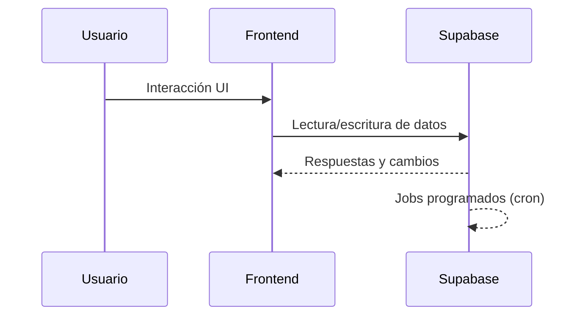

# Análisis de Arquitectura General

## Resumen Ejecutivo

El sistema Mini Market está compuesto por una aplicación web en React/TypeScript y un backend en Supabase (base de datos, Edge Functions y cron jobs). El monorepo incluye además documentación y scripts operativos; no contiene un módulo separado de APIs externas.

## Estructura del Proyecto

```
/workspace/
├── minimarket-system/          # Frontend React/TypeScript
│   ├── src/
│   │   ├── components/         # Layout y componentes reutilizables
│   │   ├── contexts/           # Context API (auth, estado global)
│   │   ├── pages/              # Módulos UI: Depósito, Stock, Tareas, etc.
│   │   └── lib/                # Helpers y servicios
│   └── package.json
├── supabase/                   # Backend Supabase
│   ├── functions/              # Edge Functions
│   ├── migrations/             # Migraciones SQL
│   ├── tables/                 # Esquemas de tablas
│   └── cron_jobs/              # Jobs programados
├── docs/                       # Documentación técnica
├── deploy.sh                   # Script de despliegue
├── setup.sh                    # Script de setup local
└── test.sh                     # Script de pruebas
```

## 1. Componentes Principales

### 1.1 Frontend (`minimarket-system/`)
- **Responsabilidad**: UI, flujos operativos y autenticación de usuarios.
- **Piezas clave**:
  - `src/pages/`: módulos (Dashboard, Depósito, Stock, Productos, Proveedores).
  - `src/contexts/`: sesión y estado compartido.
  - `src/components/`: layout y elementos reutilizables.

### 1.2 Backend (`supabase/`)
- **Responsabilidad**: persistencia de datos, lógica serverless y automatizaciones.
- **Piezas clave**:
  - `functions/`: Edge Functions (alertas de stock, reportes, API principal).
  - `migrations/`: cambios de esquema.
  - `tables/`: definición de tablas.
  - `cron_jobs/`: tareas recurrentes.

### 1.3 Operación y Soporte
- **Scripts**: `deploy.sh`, `setup.sh`, `test.sh` para tareas operativas.
- **Documentación**: `docs/` con guías de API, DB y despliegue.

## 2. Separación de Responsabilidades

- **UI y experiencia operativa**: en el frontend React.
- **Datos y reglas de negocio**: en Supabase (DB + Edge Functions).
- **Automatizaciones**: cron jobs de Supabase para notificaciones y reportes.

## 3. Configuración y Entorno

- **Frontend**: variables `VITE_*` para conectar con Supabase.
- **Backend**: configuración de Edge Functions y secretos en Supabase.
- **Observabilidad**: opcional vía Sentry y logging en guías de despliegue.

## 4. Integración entre Componentes



## 5. Alcance Actual

- El monorepo se centra en el sistema Mini Market (frontend + Supabase).
- No existe un módulo interno de APIs externas en este repositorio.
