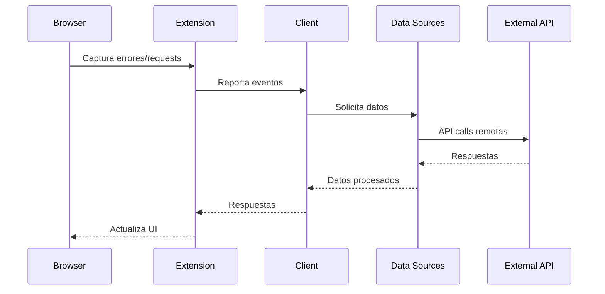

# Análisis de Arquitectura General

## Resumen Ejecutivo

Este proyecto presenta una arquitectura híbrida que combina un sistema de navegación web con capacidades de captura de errores y una plataforma de APIs externas para múltiples fuentes de datos. La arquitectura está dividida en dos dominios principales: **browser** (navegador) y **external_api** (API externa), con una configuración centralizada para gestión de dependencias y entorno.

## Estructura del Proyecto

```
/workspace/
├── browser/
│   ├── global_browser.py          # Gestor principal de Chrome/Playwright
│   └── browser_extension/
│       └── error_capture/
│           ├── manifest.json      # Configuración de extensión
│           ├── background.js      # Service worker (patrón Observer)
│           ├── content.js         # Content script (captura de errores)
│           └── injector.js        # Inyector de scripts
├── external_api/
│   ├── function_utils.py         # Utilidades de funciones/proxy
│   ├── mcp_function_list.json    # Configuración MCP (vacía)
│   └── data_sources/
│       ├── base.py              # Clase base (patrón Template)
│       ├── client.py            # Cliente singleton
│       ├── yahoo_source.py      # Implementación fuente Yahoo Finance
│       └── [otras fuentes...]    # Booking, Pinterest, Twitter, etc.
└── pyproject.toml               # Configuración de proyecto Python
```

## 1. Patrones Arquitectónicos Identificados

### 1.1 Patrones Principales

**A) Patrón de Arquitectura por Capas**
- **Capa de Presentación**: Extension del navegador (background.js, content.js)
- **Capa de Lógica de Negocio**: global_browser.py, function_utils.py
- **Capa de Datos**: data_sources/ con diferentes proveedores
- **Capa de Infraestructura**: pyproject.toml para configuración

**B) Patrón de Inyección de Dependencias**
```python
# client.py: ApiClient carga dinámicamente las fuentes de datos
def _load_data_sources(self):
    for module_info in pkgutil.iter_modules([str(current_dir)]):
        module = importlib.import_module(f".{module_info.name}", package="external_api.data_sources")
        source = item(config)  # Inyección de configuración
```

**C) Patrón Proxy**
```python
# function_utils.py: FunctionProxy actúa como intermediario
async def __call__(self, *args, **kwargs) -> ToolResult:
    request = {"request_id": str(uuid.uuid4()), ...}
    async with session.post(f"{self.get_server_url()}/execute", json=request) as response:
```

**D) Patrón Singleton**
```python
# client.py: ApiClient usa patrón singleton thread-safe
_instance = None
_lock = threading.Lock()

def __new__(cls):
    if cls._instance is None:
        with cls._lock:
            if cls._instance is None:  # Double-check
                cls._instance = super().__new__(cls)
```

**E) Patrón Template Method**
```python
# base.py: BaseAPI define estructura base
class BaseAPI(ABC):
    @abstractmethod
    def get_api_info(self) -> Dict[str, Any]:
        pass  # Implementación específica en subclases
```

### 1.2 Patrones en la Extensión del Navegador

**F) Patrón Observer**
```javascript
// background.js: Monitoreo de requests/responses
chrome.webRequest.onBeforeRequest.addListener(
  (details) => { /* handle new request */ },
  { urls: SUPABASE_PATTERNS }
);
```

**G) Patrón Intercepting Filter**
```javascript
// content.js: Filtra y trunca datos de errores
function truncateData(data, depth = 0) {
  if (depth > 3) return '[Max Depth Exceeded]';
  // ... lógica de truncamiento
}
```

## 2. Separación de Responsabilidades

### 2.1 Responsabilidades por Módulo

**Browser Module (`browser/`)**
- **Responsabilidad**: Control de navegación y captura de errores
- **Componentes**: 
  - `global_browser.py`: Gestión del ciclo de vida del navegador
  - Extensión de error capture: Monitoreo en tiempo real
- **Fronteras**: Interfaz con Playwright, comunicación con extensiones

**External API Module (`external_api/`)**
- **Responsabilidad**: Abstracción y unificación de múltiples fuentes de datos
- **Componentes**:
  - `client.py`: Punto de acceso unificado
  - `base.py`: Contratos y interfaces
  - `function_utils.py`: Utilidades de proxy y llamada remota
  - `data_sources/`: Implementaciones específicas por proveedor

**Configuration Layer**
- **Responsabilidad**: Gestión centralizada de dependencias y configuración
- **Archivos**: `pyproject.toml`, variables de entorno

### 2.2 Separación de Datos vs Lógica

**Datos (Data Sources)**
- Yahoo Finance, Twitter, Booking, Pinterest, TripAdvisor, Commodities, Patents, Scholar
- Cada fuente encapsula su lógica específica de API
- Implementaciones independientes y testeables

**Lógica (Business Logic)**
- `client.py`: Orquestación de fuentes
- `function_utils.py`: Proxy y marshalling
- `global_browser.py`: Control de navegador

## 3. Gestión de Configuración

### 3.1 Estrategia Multi-Capa

**A) Configuración a Nivel de Proyecto**
```toml
# pyproject.toml
[project]
name = "workspace"
version = "0.1.0"
requires-python = "==3.12.5"
dependencies = [
 "aiohttp==3.11.16",
 "pandas>=2.2.3",
 "requests>=2.32.3",
 # ... 50+ dependencias
]
```

**B) Configuración a Nivel de Aplicación**
```python
# client.py
config = {
    "name": "rapid_api",
    "twitter_base_url": "twitter154.p.rapidapi.com",
    "yahoo_base_url": "apidojo-yahoo-finance-v1.p.rapidapi.com",
    "external_api_proxy_url": get_external_api_proxy_url(),
    "timeout": 60,
}
```

**C) Configuración a Nivel de Fuente**
```python
# yahoo_source.py
def __init__(self, config: Dict[str, Any], proxy_url: Optional[str] = None):
    self._timeout = config["timeout"]
    self.proxy_url = config["external_api_proxy_url"]
    self.headers = {
        "X-Original-Host": config["yahoo_base_url"],
        "X-Biz-Id": "matrix-agent",
        "X-Request-Timeout": str(config["timeout"] - 5),
    }
```

### 3.2 Gestión de Variables de Entorno

```python
# function_utils.py
ENV_AGENT_NAME = "AGENT_NAME"
ENV_FUNC_SERVER_PORT = "FUNC_SERVER_PORT"

# client.py
LLM_GATEWAY_BASE_URL_ENV_NAME = "LLM_GATEWAY_BASE_URL"
```

## 4. Integración entre Componentes

### 4.1 Flujo de Datos Browser → External API



### 4.2 Integración vía Proxy

```python
# function_utils.py: Mediación entre cliente y API externa
async def __call__(self, *args, **kwargs) -> ToolResult:
    request = {
        "request_id": str(uuid.uuid4()),
        "function_name": self.origin_name or self.name,
        "parameters": call_params,
    }
    
    # Interceptación antes de la llamada
    tool_result = self._intercept_request(self.name, request)
    if tool_result is not None:
        return tool_result

    # Llamada HTTP asíncrona
    async with aiohttp.ClientSession(timeout=timeout, trust_env=True) as session:
        async with session.post(f"{self.get_server_url()}/execute", json=request) as response:
            # Procesamiento de respuesta
            result = await response.json()
            return self._intercept_response(self.name, request, result)
```

### 4.3 Comunicación Intra-Módulo

**Browser Extension Communication**
```javascript
// background.js → content.js
chrome.tabs.sendMessage(request.tabId, {
    action: isSuccess ? 'logNetworkSuccess' : 'logNetworkError',
    data: logEntry
});

// Event-driven communication
window.addEventListener('message', function (event) {
    if (event.data.type === 'MATRIX_ERROR_LOG') {
        safeLogError(event.data.data);
    }
});
```

## 5. Escalabilidad y Mantenibilidad

### 5.1 Escalabilidad Horizontal

**A) Arquitectura de Fuentes de Datos**
- **Extensibilidad**: Cada nueva fuente de datos se implementa como clase independiente
- **Carga Dinámica**: `pkgutil.iter_modules()` permite agregar fuentes sin modificar código existente
- **Pool de Conexiones**: aiohttp para manejo eficiente de múltiples requests concurrentes

```python
# Patrón de extensibilidad
for module_info in pkgutil.iter_modules([str(current_dir)]):
    if module_info.name.endswith("_source"):
        module = importlib.import_module(f".{module_info.name}")
        source = item(config)  # Instanciación automática
        type_dict[source.source_name] = source
```

**B) Paralelización en Browser**
```python
# Múltiples instancias de browser soportadas
context.on("page", handle_new_page)  # Event-driven page handling
for page in context.pages:  # Procesamiento paralelo
    await handle_new_page(page)
```

### 5.2 Escalabilidad Vertical

**A) Optimizaciones de Memoria**
```javascript
// content.js: Límites de memoria implementados
if (window.__matrix_errors__.length >= 1000) {
    window.__matrix_errors__.shift(); // Remueve errores antiguos
}

// Truncamiento inteligente de datos
const TRUNCATE_CONFIG = {
    maxStringLength: 1000,
    maxArrayLength: 50,
    maxObjectKeys: 20,
    maxStackLines: 20,
};
```

**B) Timeouts y Reintentos**
```python
# external_api: Manejo de timeouts configurable
timeout = aiohttp.ClientTimeout(total=self.timeout)
async with aiohttp.ClientSession(timeout=timeout, trust_env=True) as session:
    # Auto-retry logic implementado en aiohttp
```

### 5.3 Mantenibilidad

**A) Principios SOLID Aplicados**

1. **Single Responsibility**: Cada clase tiene una responsabilidad específica
   - `BaseAPI`: Contrato de datos
   - `FunctionProxy`: Proxy y marshalling
   - `ApiClient`: Orquestación

2. **Open/Closed**: Extensible sin modificar código base
   - Nuevas fuentes agregando archivos `*_source.py`

3. **Liskov Substitution**: Cualquier `BaseAPI` puede sustituir a otra

4. **Interface Segregation**: Métodos específicos por fuente de datos

5. **Dependency Inversion**: Depende de abstracciones (`BaseAPI`)

**B) Documentación y Introspection**

```python
# client.py: Auto-generación de documentación
def get_data_source_desc(self, source_name: str) -> str:
    # Parser de docstrings automático
    doc = inspect.getdoc(method)
    if not doc:
        continue
    docstring = parse(doc)  # Parsing estructurado
```

**C) Testing y Monitoring**

```javascript
// background.js: Logging estructurado
console.log(`[Matrix] 捕获到 Supabase ${apiInfo.apiType} 请求:`, {
    method: details.method,
    path: apiInfo.apiPath,
    query: apiInfo.query
});
```

## 6. Anti-patrones y Problemas Arquitectónicos

### 6.1 Anti-patrones Identificados

**A) Configuración Hardcodeada**
```python
# PROBLEMA: URLs y configuraciones hardcodeadas
SUPABASE_PATTERNS = [
  "*://*.supabase.co/rest/*",
  "*://*.supabase.co/functions/*",
  # ...
]
```
**Impacto**: Dificulta configuración multi-entorno, problemas de portabilidad

**B) Dependencias Excesivas**
```toml
# PROBLEMA: 50+ dependencias en pyproject.toml
dependencies = [
 "aiohttp==3.11.16", "pandas>=2.2.3", "numpy>=1.26.4",
 "matplotlib>=3.10.1", "seaborn>=0.13.2", "requests>=2.32.3",
 # ... 45 dependencias más
]
```
**Impacto**: 
- Vulnerabilidades de seguridad
- Tiempo de instalación alto
- Riesgo de conflictos de versiones

**C) Archivo MCP Vacío**
```json
# PROBLEMA: Configuración MCP vacía
[]
```
**Impacto**: Funcionalidad MCP no disponible, configuración inconsistente

**D) Logging Inconsistente**
```javascript
// PROBLEMA: Mix de console.log y no logging estructurado
console.log(`[Matrix] 捕获到请求错误:`, {error: details.error, url: details.url});
```
**Impacto**: Dificultad para análisis centralizado de logs

### 6.2 Problemas de Arquitectura

**A) Falta de Contenedores Docker**
- **Problema**: Sin docker-compose.yml, deployment complejo
- **Riesgo**: Inconsistencias entre entornos

**B) Gestión de Estado Global**
```python
# PROBLEMA: Estado global en ApiClient
_instance = None
_initialized = False
```
**Impacto**: 
- Difícil testing
- Problemas de concurrencia
- Estado hard de limpiar

**C) Ausencia de Circuit Breaker**
```python
# PROBLEMA: Sin manejo de fallos en cascada
async with session.post(f"{self.get_server_url()}/execute", json=request) as response:
    if response.status != 200:
        return ToolResult(is_error=True, message=f"Function call failed: {await response.text()}")
```
**Impacto**: Fallos en una fuente pueden afectar todo el sistema

**D) Sin Validación de Esquemas**
```python
# PROBLEMA: Validación básica con Pydantic
from pydantic import BaseModel
class ToolResult(BaseModel):
    message: str
    is_error: bool
```
**Impacto**: Datos inconsistentes entre fuentes de datos

### 6.3 Problemas de Performance

**A) Serialización Innecesaria**
```python
# PROBLEMA: Conversiones repetitivas
result.model_dump_json()  # Cada vez que se llama task_done
```
**Impacto**: Overhead de CPU innecesario

**B) Falta de Pool de Conexiones**
```python
# PROBLEMA: Nueva sesión por request
async with aiohttp.ClientSession(timeout=timeout, trust_env=True) as session:
```
**Impacto**: Overhead de establecimiento de conexiones TCP

**C) Procesamiento Síncrono en Loops**
```python
# PROBLEMA: Procesamiento secuencial
for symbol in symbols:  # Sin concurrencia
    result = await self.get_stock_price(symbol=symbol, ...)
```
**Impacto**: Latencia acumulativa para múltiples fuentes

## 7. Recomendaciones de Mejora

### 7.1 Corto Plazo

1. **Implementar Circuit Breaker Pattern**
```python
class CircuitBreaker:
    def __init__(self, failure_threshold=5, timeout=60):
        self.failure_threshold = failure_threshold
        self.timeout = timeout
        self.failure_count = 0
        self.last_failure_time = None
        self.state = 'CLOSED'  # CLOSED, OPEN, HALF_OPEN
```

2. **Agregar Schema Validation**
```python
from pydantic import BaseModel, Field

class StockPriceResponse(BaseModel):
    success: bool
    data: Optional[StockData] = None
    error: Optional[str] = None
```

3. **Implementar Connection Pooling**
```python
# Global connection pool
_global_session = None

def get_session():
    global _global_session
    if _global_session is None:
        connector = aiohttp.TCPConnector(limit=100)
        _global_session = aiohttp.ClientSession(connector=connector)
    return _global_session
```

### 7.2 Mediano Plazo

1. **Adoptar Event Sourcing**
   - Implementar eventos para cambios de estado
   - Permitir auditoría completa
   - Facilitar debugging y análisis

2. **Migrar a Microservicios**
   - Separar browser management en servicio independiente
   - Externalizar cada fuente de datos como microservicio
   - Implementar API Gateway

3. **Implementar Observabilidad Completa**
   - OpenTelemetry integration
   - Métricas estructuradas
   - Distributed tracing

### 7.3 Largo Plazo

1. **Arquitectura Hexagonal**
   - Puertos y adaptadores
   - Inyección de dependencias robusta
   - Testing de integración simplificado

2. **Event-Driven Architecture**
   - Kafka/RabbitMQ para comunicación
   - CQRS para queries complejas
   - Eventual consistency

3. **Multi-Tenancy Support**
   - Aislamiento por cliente
   - Configuración por tenant
   - Resource quotas

## 8. Conclusiones

La arquitectura presenta una **estructura sólida** con patrones bien aplicados, especialmente en la separación de responsabilidades y el diseño de fuentes de datos. Sin embargo, hay **oportunidades significativas de mejora** en áreas de configuración, observabilidad y resiliencia.

**Fortalezas:**
- Separación clara de responsabilidades
- Patrones arquitectónicos bien implementados
- Extensibilidad mediante plugin architecture
- Código bien documentado e introspectivo

**Debilidades Críticas:**
- Configuración hardcodeada y incompleta
- Falta de manejo de fallos robusto
- Ausencia de herramientas de deployment
- Logging inconsistente

**Calificación General: 7.0/10**

La arquitectura es **funcional y extensible** pero requiere mejoras en producción-readiness, observabilidad y configuración para alcanzar estándares enterprise.