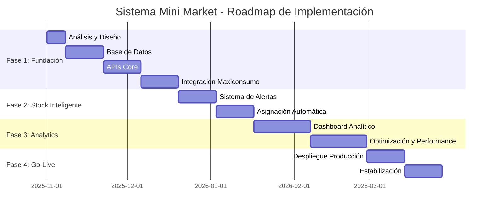

# ROADMAP Y BLUEPRINT - SISTEMA MINI MARKET

## 📋 RESUMEN EJECUTIVO

**Proyecto:** Sistema Mini Market - Automatización e Integración  
**Fecha Inicio:** 01/11/2025  
**Duración Total Estimada:** 6 meses  
**Presupuesto Total:** $180,000 - $220,000 USD  

---

## 🎯 OBJETIVOS ESTRATÉGICOS

### Objetivo Principal
Implementar un sistema integral de gestión automatizada para Mini Market que optimice operaciones, automatice procesos críticos y mejore la eficiencia operativa.

### Objetivos Específicos
- ✅ Automatización completa de precios Maxiconsumo Necochea
- ✅ Gestión inteligente de stock en depósito
- ✅ Asignación automática de productos faltantes
- ✅ Base de datos unificada de proveedores y productos
- ✅ Reducción del 60% en tiempo de gestión manual
- ✅ Eliminación del 90% de errores en actualización de precios

---

## 📊 ANÁLISIS DE PRIORIDADES

### 🔴 CRÍTICAS (Inicio inmediato)
1. **Base de datos de productos/proveedores** - Foundation del sistema
2. **API Integración Maxiconsumo** - Automatización precios
3. **Sistema de alertas stock mínimo** - Prevención roturas

### 🟡 IMPORTANTES (Fase 2)
1. **Dashboard analítico** - Monitoreo y control
2. **Gestión automática reordenes** - Optimización inventarios
3. **Reportes automatizados** - Business Intelligence

### 🟢 DESEABLES (Fase 3)
1. **App móvil** - Acceso remoto
2. **Integración con sistemas contables** - Cierre administrativo
3. **Módulo de promociones** - Marketing automation

---

## 🗓️ ROADMAP DETALLADO

### **FASE 1: FUNDACIÓN Y BASE DE DATOS** 
**⏱️ Duración:** 8 semanas (01/11/2025 - 26/12/2025)

#### **Sprint 1-2: Análisis y Diseño (Semanas 1-2)**
- **Semana 1:**
  - ✅ Auditoría completa de sistemas actuales
  - ✅ Mapeo de procesos existentes
  - ✅ Identificación de proveedores y productos actuales
  - ✅ Definición de arquitectura del sistema
  
  **Entregables:**
  - Documento de análisis funcional
  - Arquitectura del sistema
  - Especificaciones técnicas
  
  **Recursos:** 1 Arquitecto, 1 Analista de Negocio, 40h

- **Semana 2:**
  - ✅ Diseño de base de datos
  - ✅ Definición de APIs internas
  - ✅ Especificación de integraciones
  - ✅ Plan de pruebas
  
  **Entregables:**
  - Esquema de base de datos
  - Documentación de APIs
  - Plan de migración de datos
  
  **Recursos:** 1 DBA, 1 Arquitecto, 1 Desarrollador Senior, 60h

#### **Sprint 3-4: Base de Datos (Semanas 3-4)**
- **Semana 3:**
  - ✅ Implementación de base de datos PostgreSQL
  - ✅ Creación de tablas maestras
  - ✅ Configuración de índices y constraints
  
  **Entregables:**
  - Base de datos funcional
  - Scripts de migración
  - Documentación técnica
  
  **Recursos:** 1 DBA, 1 Desarrollador Backend, 80h

- **Semana 4:**
  - ✅ Migración de datos existentes
  - ✅ Validación de integridad de datos
  - ✅ Implementación de procedimientos almacenados
  
  **Entregables:**
  - Base de datos poblada y funcional
  - Reporte de validación de datos
  - Procedimientos de backup
  
  **Recursos:** 1 DBA, 1 Analista de Datos, 80h

#### **Sprint 5-6: APIs Core (Semanas 5-6)**
- **Semana 5:**
  - ✅ Desarrollo de APIs para productos
  - ✅ APIs para proveedores
  - ✅ APIs para gestión de stock
  
  **Entregables:**
  - APIs REST funcionales
  - Documentación Swagger
  - Tests unitarios
  
  **Recursos:** 2 Desarrolladores Backend, 160h

- **Semana 6:**
  - ✅ APIs para usuarios y permisos
  - ✅ APIs de reportes básicos
  - ✅ Implementación de autenticación JWT
  
  **Entregables:**
  - Sistema de autenticación completo
  - APIs de seguridad
  - Logs y auditoría
  
  **Recursos:** 2 Desarrolladores Backend, 1 DevOps, 160h

#### **Sprint 7-8: Integración Maxiconsumo (Semanas 7-8)**
- **Semana 7:**
  - ✅ Desarrollo de conector Maxiconsumo
  - ✅ Sincronización de precios
  - ✅ Manejo de errores y reintentos
  
  **Entregables:**
  - Conector Maxiconsumo funcional
  - Sincronización automática de precios
  - Sistema de alertas por errores
  
  **Recursos:** 1 Desarrollador Especializado, 1 Analista de Integración, 80h

- **Semana 8:**
  - ✅ Testing de integración completa
  - ✅ Documentación de usuario
  - ✅ Capacitación inicial
  
  **Entregables:**
  - Sistema integrado funcional
  - Manual de usuario v1.0
  - Registro de tests completados
  
  **Recursos:** 1 QA, 1 Desarrollador, 1 Trainer, 60h

**📊 Recursos Fase 1:** $45,000 - $55,000 USD
**👥 Equipo:** 6 personas
**⚠️ Riesgos:** Integración compleja, migración de datos

---

### **FASE 2: GESTIÓN INTELIGENTE DE STOCK**
**⏱️ Duración:** 6 semanas (27/12/2025 - 07/02/2026)

#### **Sprint 9-10: Sistema de Alertas (Semanas 9-10)**
- **Semana 9:**
  - ✅ Configuración de stock mínimo por producto
  - ✅ Sistema de alertas automáticas
  - ✅ Dashboard de supervisión de stock
  
  **Entregables:**
  - Sistema de alertas configurado
  - Dashboard de stock
  - Notificaciones automáticas
  
  **Recursos:** 1 Desarrollador Frontend, 1 Desarrollador Backend, 1 UI/UX, 80h

- **Semana 10:**
  - ✅ Pruebas de escenarios de stock mínimo
  - ✅ Validación de alertas
  - ✅ Optimización de rendimiento
  
  **Entregables:**
  - Sistema validado y funcional
  - Reporte de performance
  - Manual de configuración
  
  **Recursos:** 1 QA, 1 Desarrollador, 1 Analista de Negocio, 60h

#### **Sprint 11-12: Asignación Automática (Semanas 11-12)**
- **Semana 11:**
  - ✅ Algoritmo de asignación automática
  - ✅ Priorización inteligente por productos
  - ✅ Integración con proveedores
  
  **Entregables:**
  - Motor de asignación automática
  - Lógica de priorización
  - Conectores con proveedores
  
  **Recursos:** 1 Desarrollador Senior, 1 Analista de Algoritmos, 1 Desarrollador Integración, 120h

- **Semana 12:**
  - ✅ Sistema de auto-reorden
  - ✅ Validación de procesos automáticos
  - ✅ Integración completa con stock
  
  **Entregables:**
  - Sistema de auto-reorden funcional
  - Procesos automatizados completos
  - Testing de integración end-to-end
  
  **Recursos:** 2 Desarrolladores, 1 QA, 1 DevOps, 120h

**📊 Recursos Fase 2:** $32,000 - $40,000 USD
**👥 Equipo:** 5 personas
**⚠️ Riesgos:** Complejidad algorítmica, performance del sistema

---

### **FASE 3: ANALYTICS Y OPTIMIZACIÓN**
**⏱️ Duración:** 8 semanas (08/02/2026 - 04/04/2026)

#### **Sprint 13-15: Dashboard Analítico (Semanas 13-15)**
- **Semana 13:**
  - ✅ Desarrollo de métricas clave (KPIs)
  - ✅ Panel de control ejecutivo
  - ✅ Reportes automatizados
  
  **Entregables:**
  - Dashboard ejecutivo
  - KPIs configurados
  - Reportes automáticos
  
  **Recursos:** 1 Desarrollador Frontend, 1 Desarrollador BI, 1 Analista de Datos, 120h

- **Semana 14:**
  - ✅ Análisis predictivo de demanda
  - ✅ Alertas predictivas
  - ✅ Optimización de inventarios
  
  **Entregables:**
  - Modelos predictivos
  - Sistema de alertas inteligentes
  - Algoritmos de optimización
  
  **Recursos:** 1 Data Scientist, 1 Desarrollador ML, 1 Analista de Negocio, 160h

- **Semana 15:**
  - ✅ Testing de modelos predictivos
  - ✅ Validación de accuracy
  - ✅ Ajustes y calibración
  
  **Entregables:**
  - Modelos validados
  - Métricas de performance
  - Reporte de validación
  
  **Recursos:** 1 Data Scientist, 1 QA, 1 Analista de Datos, 100h

#### **Sprint 16-18: Optimización y Performance (Semanas 16-18)**
- **Semana 16:**
  - ✅ Optimización de base de datos
  - ✅ Caching de consultas frecuentes
  - ✅ Optimización de APIs
  
  **Entregables:**
  - Database optimizada
  - Sistema de cache implementado
  - APIs optimizadas
  
  **Recursos:** 1 DBA Senior, 1 Desarrollador Backend, 1 DevOps, 120h

- **Semana 17:**
  - ✅ Testing de carga y performance
  - ✅ Ajustes de rendimiento
  - ✅ Documentación técnica final
  
  **Entregables:**
  - Reportes de performance
  - Sistema optimizado
  - Documentación técnica completa
  
  **Recursos:** 1 QA, 1 DevOps, 1 Desarrollador, 80h

- **Semana 18:**
  - ✅ Pruebas finales end-to-end
  - ✅ Capacitación avanzada
  - ✅ Preparación para producción
  
  **Entregables:**
  - Sistema completo validado
  - Usuarios capacitados
  - Plan de go-live
  
  **Recursos:** 1 QA, 1 Trainer, 1 Desarrollador, 80h

**📊 Recursos Fase 3:** $45,000 - $55,000 USD
**👥 Equipo:** 6 personas
**⚠️ Riesgos:** Complejidad de modelos ML, performance bajo carga

---

### **FASE 4: DESPLIEGUE Y GO-LIVE**
**⏱️ Duración:** 4 semanas (05/04/2026 - 02/05/2026)

#### **Sprint 19-20: Despliegue Producción (Semanas 19-20)**
- **Semana 19:**
  - ✅ Configuración de ambiente productivo
  - ✅ Migración final de datos
  - ✅ Testing de producción
  
  **Entregables:**
  - Ambiente productivo configurado
  - Datos migrados y validados
  - Tests de producción pasados
  
  **Recursos:** 1 DevOps, 1 DBA, 1 QA, 1 Desarrollador, 100h

- **Semana 20:**
  - ✅ Go-live gradual
  - ✅ Monitoreo intensivo
  - ✅ Soporte 24/7
  
  **Entregables:**
  - Sistema en producción
  - Monitoreo activo
  - Soporte implementado
  
  **Recursos:** DevOps, 2 Desarrolladores, 1 Support, 160h

#### **Sprint 21-22: Estabilización (Semanas 21-22)**
- **Semana 21:**
  - ✅ Monitoreo de métricas de uso
  - ✅ Corrección de bugs menores
  - ✅ Ajustes de performance
  
  **Entregables:**
  - Sistema estabilizado
  - Métricas de uso optimizadas
  - Issues críticos resueltos
  
  **Recursos:** 2 Desarrolladores, 1 QA, 1 DevOps, 120h

- **Semana 22:**
  - ✅ Documentación final actualizada
  - ✅ Capacitación completa de usuarios
  - ✅ Plan de mantenimiento
  
  **Entregables:**
  - Documentación final completa
  - Usuarios completamente capacitados
  - Plan de mantenimiento y soporte
  
  **Recursos:** 1 Trainer, 1 Technical Writer, 1 Desarrollador, 80h

**📊 Recursos Fase 4:** $25,000 - $30,000 USD
**👥 Equipo:** 5 personas
**⚠️ Riesgos:** Problemas de go-live, resistencia al cambio

---

## 💰 PRESUPUESTO DETALLADO

### Desglose por Fase

| **Fase** | **Duración** | **Recursos Humanos** | **Tecnología** | **Total USD** |
|----------|--------------|---------------------|----------------|---------------|
| Fase 1: Fundación | 8 semanas | $35,000 | $10,000 | $45,000 - $55,000 |
| Fase 2: Stock Inteligente | 6 semanas | $28,000 | $7,000 | $32,000 - $40,000 |
| Fase 3: Analytics | 8 semanas | $38,000 | $12,000 | $45,000 - $55,000 |
| Fase 4: Go-Live | 4 semanas | $20,000 | $5,000 | $25,000 - $30,000 |
| **TOTAL** | **26 semanas** | **$121,000** | **$34,000** | **$147,000 - $180,000** |

### Costos Adicionales
- **Contingencia (10%):** $15,000 - $18,000
- **Licencias Software:** $8,000/año
- **Hosting y Infraestructura:** $3,000/año
- **Soporte y Mantenimiento:** $12,000/año

### **PRESUPUESTO TOTAL PROYECTO: $180,000 - $220,000 USD**

---

## 👥 ESTRUCTURA DEL EQUIPO

### **Core Team (Permanente)**
- **1 Project Manager** - Gestión integral del proyecto
- **1 Solution Architect** - Arquitectura y diseño técnico
- **1 Senior Full-Stack Developer** - Desarrollo principal
- **1 QA Lead** - Calidad y testing
- **1 DevOps Engineer** - Infraestructura y despliegue

### **Equipo Variable (Por Fase)**
- **Fase 1:** 1 DBA, 1 Analista de Negocio, 1 Integración Specialist
- **Fase 2:** 1 Frontend Developer, 1 UI/UX Designer
- **Fase 3:** 1 Data Scientist, 1 ML Engineer, 1 BI Developer
- **Fase 4:** 1 Technical Writer, 1 Trainer, 1 Support Engineer

### **Roles Especializados**
- **Product Owner:** Representa las necesidades del negocio
- **Business Analyst:** Análisis funcional y requerimientos
- **Data Migration Specialist:** Migración y validación de datos
- **Security Specialist:** Implementación de medidas de seguridad

---

## 📋 CHECKLIST COMPLETO DE PRODUCCIÓN

### **Pre-Desarrollo ✅**
- [ ] **Análisis de requerimientos completado**
  - [ ] Entrevistas con usuarios clave
  - [ ] Documentación de procesos actuales
  - [ ] Identificación de integraciones necesarias
  - [ ] Validación de requerimientos con stakeholders

- [ ] **Arquitectura del sistema definida**
  - [ ] Stack tecnológico seleccionado
  - [ ] Patrones de diseño definidos
  - [ ] Arquitectura de base de datos diseñada
  - [ ] Plan de escalabilidad establecido

- [ ] **Ambiente de desarrollo configurado**
  - [ ] Repositorio de código configurado
  - [ ] Pipeline CI/CD implementado
  - [ ] Ambientes de desarrollo/test/staging
  - [ ] Herramientas de monitoreo instaladas

### **Desarrollo - Fase 1 ✅**
- [ ] **Base de datos implementada**
  - [ ] Tablas maestras creadas
  - [ ] Índices y constraints definidos
  - [ ] Procedimientos almacenados implementados
  - [ ] Migración de datos completada y validada

- [ ] **APIs Core desarrolladas**
  - [ ] APIs de productos/proveedores
  - [ ] APIs de gestión de stock
  - [ ] Sistema de autenticación
  - [ ] Documentación Swagger actualizada

- [ ] **Integración Maxiconsumo**
  - [ ] Conector desarrollado y probado
  - [ ] Sincronización de precios automatizada
  - [ ] Manejo de errores implementado
  - [ ] Logs y auditoría configurados

### **Desarrollo - Fase 2 ✅**
- [ ] **Sistema de alertas de stock**
  - [ ] Configuración de stock mínimo
  - [ ] Sistema de notificaciones
  - [ ] Dashboard de supervisión
  - [ ] Alertas probadas en diferentes escenarios

- [ ] **Asignación automática de productos**
  - [ ] Algoritmo de asignación desarrollado
  - [ ] Priorización inteligente implementada
  - [ ] Integración con proveedores
  - [ ] Sistema de auto-reorden funcional

### **Desarrollo - Fase 3 ✅**
- [ ] **Dashboard analítico**
  - [ ] KPIs configurados y validados
  - [ ] Reportes automáticos implementados
  - [ ] Dashboard ejecutivo funcional
  - [ ] Alertas predictivas operativas

- [ ] **Optimización y performance**
  - [ ] Base de datos optimizada
  - [ ] Sistema de cache implementado
  - [ ] Testing de carga completado
  - [ ] Performance validada bajo escenarios reales

### **Testing y QA ✅**
- [ ] **Testing funcional completado**
  - [ ] Tests unitarios > 80% coverage
  - [ ] Tests de integración pasados
  - [ ] Tests end-to-end ejecutados
  - [ ] Casos de prueba documentados

- [ ] **Testing de performance**
  - [ ] Load testing completado
  - [ ] Stress testing validado
  - [ ] Performance benchmarks establecidos
  - [ ] Bottlenecks identificados y corregidos

- [ ] **Testing de seguridad**
  - [ ] Penetration testing realizado
  - [ ] Vulnerabilidades corregidas
  - [ ] Accesos y permisos validados
  - [ ] Compliance con estándares de seguridad

### **Despliegue y Producción ✅**
- [ ] **Preparación de producción**
  - [ ] Ambiente productivo configurado
  - [ ] Backup y recovery plan implementado
  - [ ] Monitoreo en producción configurado
  - [ ] SSL/TLS certificados instalados

- [ ] **Migración de datos**
  - [ ] Datos de producción migrados
  - [ ] Integridad de datos validada
  - [ ] Migración reversa planificada
  - [ ] Rollback procedures documentados

- [ ] **Go-Live**
  - [ ] Plan de go-live ejecutado
  - [ ] Monitoreo intensivo activo
  - [ ] Soporte 24/7 disponible
  - [ ] Métricas de éxito establecidas

### **Post Go-Live ✅**
- [ ] **Estabilización**
  - [ ] Bugs críticos corregidos
  - [ ] Performance optimizada
  - [ ] Satisfacción de usuarios validada
  - [ ] Adopción del sistema confirmada

- [ ] **Documentación y capacitación**
  - [ ] Manuales de usuario completados
  - [ ] Documentación técnica actualizada
  - [ ] Capacitación de usuarios completada
  - [ ] Knowledge base actualizada

- [ ] **Plan de mantenimiento**
  - [ ] SLA de soporte definido
  - [ ] Procedimientos de mantenimiento
  - [ ] Plan de actualizaciones futuras
  - [ ] Métricas de performance establecidas

---

## 🛡️ GESTIÓN DE RIESGOS

### **Riesgos Críticos y Mitigaciones**

#### **🔴 ALTO RIESGO**
1. **Integración Compleja con Maxiconsumo**
   - **Probabilidad:** 40% | **Impacto:** Alto
   - **Mitigación:** Desarrollo de prototipo temprano, múltiples puntos de fallback, SLA con proveedor

2. **Pérdida de Datos en Migración**
   - **Probabilidad:** 25% | **Impacto:** Alto
   - **Mitigación:** Múltiples backups, migración gradual, plan de rollback

3. **Resistencia al Cambio de Usuarios**
   - **Probabilidad:** 50% | **Impacto:** Medio
   - **Mitigación:** Capacitación intensiva, user champions, feedback continuo

#### **🟡 MEDIO RIESGO**
1. **Performance del Sistema**
   - **Probabilidad:** 30% | **Impacto:** Medio
   - **Mitigación:** Testing de carga temprana, optimización continua

2. **Complejidad de Algoritmos de Asignación**
   - **Probabilidad:** 35% | **Impacto:** Medio
   - **Mitigación:** Algoritmos iterativos, testing extensivo, validación con datos reales

#### **🟢 BAJO RIESGO**
1. **Cambios en Requerimientos**
   - **Probabilidad:** 60% | **Impacto:** Bajo
   - **Mitigación:** Metodología ágil, cambios controlados

---

## 📊 MÉTRICAS DE ÉXITO

### **KPIs Operacionales**
- **Tiempo de gestión manual:** Reducción del 60%
- **Errores en actualización de precios:** Reducción del 90%
- **Disponibilidad del sistema:** > 99.5%
- **Tiempo de respuesta promedio:** < 2 segundos

### **KPIs de Negocio**
- **Reducción de stock-out:** 70%
- **Optimización de inventarios:** 25%
- **Satisfacción de usuarios:** > 85%
- **ROI del proyecto:** > 300% en 18 meses

### **Métricas Técnicas**
- **Cobertura de tests:** > 80%
- **Uptime del sistema:** > 99.5%
- **Tiempo de recuperación:** < 1 hora
- **Performance score:** > 90%

---

## 🔧 ESPECIFICACIONES TÉCNICAS

### **Stack Tecnológico Recomendado**

#### **Backend**
- **Runtime:** Node.js 18+ / Python 3.11+
- **Framework:** Express.js / FastAPI
- **Base de Datos:** PostgreSQL 15+
- **Cache:** Redis 7+
- **Message Queue:** RabbitMQ

#### **Frontend**
- **Framework:** React 18+ / Vue.js 3+
- **Estado:** Redux / Pinia
- **UI Library:** Material-UI / Ant Design
- **Charts:** Chart.js / D3.js

#### **DevOps**
- **Containerization:** Docker + Kubernetes
- **CI/CD:** GitLab CI / GitHub Actions
- **Monitoring:** Prometheus + Grafana
- **Logging:** ELK Stack
- **Cloud:** AWS / Google Cloud

### **Arquitectura del Sistema**
```
┌─────────────────┐    ┌─────────────────┐    ┌─────────────────┐
│   Frontend      │    │   Backend API   │    │   Base Datos    │
│   (React/Vue)   │◄──►│   (Node.js)     │◄──►│   (PostgreSQL)  │
└─────────────────┘    └─────────────────┘    └─────────────────┘
         │                       │                       │
         │              ┌─────────────────┐              │
         │              │   Message Queue │              │
         │              │   (RabbitMQ)    │              │
         │              └─────────────────┘              │
         │                       │                       │
         ▼                       ▼                       ▼
┌─────────────────┐    ┌─────────────────┐    ┌─────────────────┐
│   Integrations  │    │   Analytics     │    │   Monitoring    │
│   (Maxiconsumo) │    │   (Python/ML)   │    │   (Grafana)     │
└─────────────────┘    └─────────────────┘    └─────────────────┘
```

---

## 📞 COMUNICACIÓN Y GOVERNANCE

### **Estructura de Comunicación**

#### **Reuniones Regulares**
- **Daily Standups:** Todos los días, 15 minutos
- **Sprint Planning:** Inicio de cada sprint, 2 horas
- **Sprint Review:** Final de cada sprint, 1 hora
- **Sprint Retrospective:** Final de cada sprint, 1 hora
- **Weekly Status:** Viernes, 30 minutos con stakeholders
- **Monthly Steering Committee:** Revisión ejecutiva mensual

#### **Reportes y Documentación**
- **Daily Burndown:** Seguimiento diario de progreso
- **Weekly Status Report:** Estado semanal detallado
- **Sprint Report:** Reporte de cada sprint
- **Monthly Executive Summary:** Resumen ejecutivo mensual

### **Gestión de Cambios**
- **Change Request Process:** Procedimiento formal para cambios
- **Impact Assessment:** Evaluación de impacto para cada cambio
- **Approval Matrix:** Matriz de aprobación por tipo de cambio
- **Change Log:** Registro detallado de todos los cambios

---

## 🚀 PLAN DE IMPLEMENTACIÓN

### **Cronograma General**



### **Hitos Principales (Milestones)**

#### **Milestone 1: Fundación Completa** 
- **Fecha:** 26/12/2025
- **Criterios:** Base de datos funcional, APIs core, integración Maxiconsumo
- **Presupuesto Consumido:** $45,000 - $55,000

#### **Milestone 2: Gestión Inteligente**
- **Fecha:** 07/02/2026  
- **Criterios:** Sistema de alertas, asignación automática
- **Presupuesto Consumido:** $77,000 - $95,000

#### **Milestone 3: Analytics Operativo**
- **Fecha:** 04/04/2026
- **Criterios:** Dashboard analítico, optimización completa
- **Presupuesto Consumido:** $122,000 - $150,000

#### **Milestone 4: Sistema Productivo**
- **Fecha:** 02/05/2026
- **Criterios:** Sistema en producción, usuarios capacitados
- **Presupuesto Consumido:** $147,000 - $180,000

---

## 📝 CONCLUSIONES Y PRÓXIMOS PASOS

### **Factores Críticos de Éxito**
1. **Compromiso de Stakeholders:** Involucramiento continuo del negocio
2. **Equipo Técnico Competente:** Especialistas en cada tecnología
3. **Metodología Ágil:** Iteraciones cortas y feedback continuo
4. **Testing Continuo:** Validación en cada fase
5. **Comunicación Transparente:** Reporting constante

### **Recomendaciones Estratégicas**
1. **Implementación Gradual:** Despliegue por módulos para reducir riesgo
2. **User Adoption:** Estrategia fuerte de change management
3. **Data Quality:** Inversión temprana en calidad de datos
4. **Performance Monitoring:** Implementación desde el inicio
5. **Documentation:** Documentación continua y actualizada

### **Próximas Acciones Inmediatas**
1. **Aprobación del Roadmap** - Validación con stakeholders
2. **Selección del Equipo** - Contratación de roles clave
3. **Setup del Ambiente** - Configuración inicial del proyecto
4. **Kick-off Meeting** - Lanzamiento oficial del proyecto
5. **Primer Sprint Planning** - Planificación detallada Sprint 1

---

## 📞 CONTACTO Y SOPORTE

**Project Manager:** [Nombre del PM]  
**Email:** pm@minimarket.com  
**Teléfono:** +54 XXX XXX XXXX

**Technical Lead:** [Nombre del Tech Lead]  
**Email:** tech@minimarket.com  
**Teléfono:** +54 XXX XXX XXXX

**Business Analyst:** [Nombre del BA]  
**Email:** ba@minimarket.com  
**Teléfono:** +54 XXX XXX XXXX

---

*Documento generado el 31/10/2025 - Versión 1.0*  
*Última actualización: 31/10/2025*